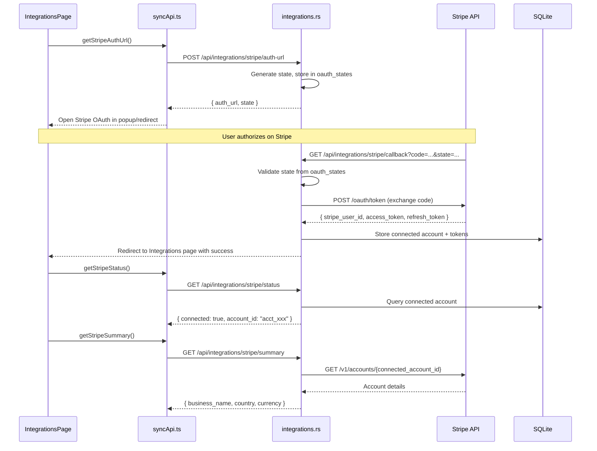

# Design Document: Integrations Completion

## Overview

This design specifies the implementation of payment provider integrations (Stripe Connect, Square, Clover) and Supabase Hub enhancements, plus a Data Manager for bulk operations. Phase 1 covers integration management with real data reads. Phase 2 covers Stripe hosted checkout (Checkout Sessions) for POS orders with webhook updates.

**Key Rule:** Cards are hidden unless fully functional. No "Coming Soon" placeholders.

## Architecture

### High-Level Architecture

```
┌─────────────────────────────────────────────────────────────────────────┐
│                           Frontend (React)                               │
│  ┌─────────────────────────────────────────────────────────────────┐   │
│  │  Settings → Integrations Page                                    │   │
│  │  frontend/src/settings/pages/IntegrationsPage.tsx               │   │
│  │  ┌─────────┐ ┌─────────┐ ┌─────────┐ ┌─────────┐               │   │
│  │  │ Stripe  │ │ Square  │ │ Clover  │ │Supabase │               │   │
│  │  │(OAuth)  │ │(API Key)│ │(OAuth)  │ │(API Key)│               │   │
│  │  └────┬────┘ └────┬────┘ └────┬────┘ └────┬────┘               │   │
│  └───────┼──────────┼──────────┼──────────┼────────────────────────┘   │
│  ┌─────────────────────────────────────────────────────────────────┐   │
│  │  Settings → Data Manager Page                                    │   │
│  │  frontend/src/settings/pages/DataManagerPage.tsx                │   │
│  └─────────────────────────────────────────────────────────────────┘   │
└──────────────────────────────────────────────────────────────────────────┘
           │
           ▼
┌─────────────────────────────────────────────────────────────────────────┐
│                      Backend (Rust/Actix-web)                           │
│  ┌─────────────────────────────────────────────────────────────────┐   │
│  │  handlers/integrations.rs                                        │   │
│  │  Stripe: auth-url, callback, status, summary, test, disconnect   │   │
│  │  Square: credentials, status, summary, test, disconnect          │   │
│  │  Clover: auth-url, callback, status, summary, test, disconnect   │   │
│  │  Supabase: credentials, status, summary, test, disconnect        │   │
│  └─────────────────────────────────────────────────────────────────┘   │
│  ┌─────────────────────────────────────────────────────────────────┐   │
│  │  handlers/data_manager.rs (new)                                  │   │
│  │  seed, upload, purge, status                                     │   │
│  └─────────────────────────────────────────────────────────────────┘   │
│  ┌─────────────────────────────────────────────────────────────────┐   │
│  │  handlers/payments.rs (Phase 2)                                  │   │
│  │  create-checkout-session, webhooks, payment-status               │   │
│  └─────────────────────────────────────────────────────────────────┘   │
│  ┌─────────────────────────────────────────────────────────────────┐   │
│  │  connectors/stripe/client.rs + oauth.rs (new)                    │   │
│  │  connectors/square/client.rs (new)                               │   │
│  │  connectors/clover/client.rs + oauth.rs (new)                    │   │
│  └─────────────────────────────────────────────────────────────────┘   │
└─────────────────────────────────────────────────────────────────────────┘
           │
           ▼
┌─────────────────────────────────────────────────────────────────────────┐
│                      SQLite Database                                     │
│  integration_credentials (extended)                                      │
│  integration_status (existing)                                           │
│  integration_logs (new)                                                  │
│  stripe_connected_accounts (new)                                         │
│  payments (new - Phase 2)                                                │
│  data_batches (new)                                                      │
└─────────────────────────────────────────────────────────────────────────┘
```

### Stripe Connect OAuth Flow



## Components and Interfaces

### Frontend Components

#### 1. IntegrationsPage (Extended)
**Path:** `frontend/src/settings/pages/IntegrationsPage.tsx`

Only shows cards for fully implemented integrations. No "Coming Soon" placeholders.

```typescript
// Integrations are only shown if backend is fully implemented
// Cards hidden entirely if backend returns 404 on status check

interface IntegrationCard {
  id: string;
  name: string;
  description: string;
  authType: 'oauth' | 'api_key';
  status: 'connected' | 'disconnected' | 'error';
  summary?: ProviderSummary;
}

// Provider-specific summary data
interface StripeSummary {
  business_name: string;
  country: string;
  default_currency: string;
  account_id_masked: string; // "acct_...xxxx"
}

interface SquareSummary {
  location_name: string;
  address: string;
  capabilities: string[];
}

interface CloverSummary {
  merchant_name: string;
  address: string;
}

interface SupabaseSummary {
  project_name: string;
  last_sync_at: string | null;
  pending_queue_count: number;
}
```

#### 2. IntegrationLogsDrawer
**Path:** `frontend/src/settings/components/IntegrationLogsDrawer.tsx`

Displays real backend events for each integration.

```typescript
interface IntegrationLog {
  id: string;
  timestamp: string;
  level: 'info' | 'warning' | 'error';
  event: string; // 'connected', 'tested', 'disconnected', 'sync_started', etc.
  message: string;
  details?: Record<string, unknown>;
}
```

#### 3. DataManagerPage (New)
**Path:** `frontend/src/settings/pages/DataManagerPage.tsx`

Bulk data operations: seed load, upload, purge.

```typescript
interface DataBatch {
  id: string;
  type: 'seed' | 'upload' | 'purge';
  entity_type: string; // 'products', 'customers', etc.
  record_count: number;
  status: 'pending' | 'processing' | 'completed' | 'failed';
  created_at: string;
  completed_at?: string;
  error_message?: string;
}
```

#### 4. Sync API Extensions
**Path:** `frontend/src/services/syncApi.ts`

```typescript
export const syncApi = {
  // Stripe (OAuth)
  getStripeAuthUrl: async (): Promise<{ auth_url: string; state: string }> => {
    const response = await api.post('/api/integrations/stripe/auth-url');
    return response.data;
  },
  getStripeStatus: async (): Promise<IntegrationStatusResponse> => {
    const response = await api.get('/api/integrations/stripe/status');
    return response.data;
  },
  getStripeSummary: async (): Promise<StripeSummary> => {
    const response = await api.get('/api/integrations/stripe/summary');
    return response.data;
  },
  testStripeConnection: async (): Promise<{ success: boolean; message: string }> => {
    const response = await api.post('/api/integrations/stripe/test');
    return response.data;
  },
  disconnectStripe: async (): Promise<{ success: boolean; message: string }> => {
    const response = await api.delete('/api/integrations/stripe/disconnect');
    return response.data;
  },
  getStripeLogs: async (params?: LogsParams): Promise<LogsResponse> => {
    const response = await api.get('/api/integrations/stripe/logs', { params });
    return response.data;
  },

  // Square (API Key)
  connectSquare: async (credentials: SquareCredentials): Promise<{ success: boolean; message: string }> => {
    const response = await api.post('/api/integrations/square/credentials', credentials);
    return response.data;
  },
  getSquareStatus: async (): Promise<IntegrationStatusResponse> => {
    const response = await api.get('/api/integrations/square/status');
    return response.data;
  },
  getSquareSummary: async (): Promise<SquareSummary> => {
    const response = await api.get('/api/integrations/square/summary');
    return response.data;
  },
  testSquareConnection: async (): Promise<{ success: boolean; message: string }> => {
    const response = await api.post('/api/integrations/square/test');
    return response.data;
  },
  disconnectSquare: async (): Promise<{ success: boolean; message: string }> => {
    const response = await api.delete('/api/integrations/square/disconnect');
    return response.data;
  },
  getSquareLogs: async (params?: LogsParams): Promise<LogsResponse> => {
    const response = await api.get('/api/integrations/square/logs', { params });
    return response.data;
  },

  // Clover (OAuth)
  getCloverAuthUrl: async (): Promise<{ auth_url: string; state: string }> => {
    const response = await api.post('/api/integrations/clover/auth-url');
    return response.data;
  },
  getCloverStatus: async (): Promise<IntegrationStatusResponse> => {
    const response = await api.get('/api/integrations/clover/status');
    return response.data;
  },
  getCloverSummary: async (): Promise<CloverSummary> => {
    const response = await api.get('/api/integrations/clover/summary');
    return response.data;
  },
  testCloverConnection: async (): Promise<{ success: boolean; message: string }> => {
    const response = await api.post('/api/integrations/clover/test');
    return response.data;
  },
  disconnectClover: async (): Promise<{ success: boolean; message: string }> => {
    const response = await api.delete('/api/integrations/clover/disconnect');
    return response.data;
  },
  getCloverLogs: async (params?: LogsParams): Promise<LogsResponse> => {
    const response = await api.get('/api/integrations/clover/logs', { params });
    return response.data;
  },

  // Supabase (API Key)
  connectSupabase: async (credentials: SupabaseCredentials): Promise<{ success: boolean; message: string }> => {
    const response = await api.post('/api/integrations/supabase/credentials', credentials);
    return response.data;
  },
  getSupabaseStatus: async (): Promise<IntegrationStatusResponse> => {
    const response = await api.get('/api/integrations/supabase/status');
    return response.data;
  },
  getSupabaseSummary: async (): Promise<SupabaseSummary> => {
    const response = await api.get('/api/integrations/supabase/summary');
    return response.data;
  },
  testSupabaseConnection: async (): Promise<{ success: boolean; message: string }> => {
    const response = await api.post('/api/integrations/supabase/test');
    return response.data;
  },
  disconnectSupabase: async (): Promise<{ success: boolean; message: string }> => {
    const response = await api.delete('/api/integrations/supabase/disconnect');
    return response.data;
  },
  getSupabaseLogs: async (params?: LogsParams): Promise<LogsResponse> => {
    const response = await api.get('/api/integrations/supabase/logs', { params });
    return response.data;
  },

  // Data Manager
  seedData: async (entityType: string): Promise<DataBatch> => {
    const response = await api.post('/api/data-manager/seed', { entity_type: entityType });
    return response.data;
  },
  uploadData: async (entityType: string, file: File): Promise<DataBatch> => {
    const formData = new FormData();
    formData.append('file', file);
    formData.append('entity_type', entityType);
    const response = await api.post('/api/data-manager/upload', formData);
    return response.data;
  },
  purgeData: async (batchId: string): Promise<{ success: boolean; message: string }> => {
    const response = await api.delete(`/api/data-manager/batches/${batchId}`);
    return response.data;
  },
  getDataBatches: async (): Promise<DataBatch[]> => {
    const response = await api.get('/api/data-manager/batches');
    return response.data;
  },
  getBatchStatus: async (batchId: string): Promise<DataBatch> => {
    const response = await api.get(`/api/data-manager/batches/${batchId}`);
    return response.data;
  },

  // Phase 2: Stripe Checkout
  createCheckoutSession: async (orderId: string, amount: number, currency: string): Promise<CheckoutSessionResponse> => {
    const response = await api.post('/api/payments/checkout-session', { order_id: orderId, amount, currency });
    return response.data;
  },
  getPaymentStatus: async (orderId: string): Promise<PaymentStatus> => {
    const response = await api.get(`/api/payments/orders/${orderId}/payment`);
    return response.data;
  },
};
```

### Backend Components

#### 1. Stripe Connector (OAuth)
**Path:** `backend/crates/server/src/connectors/stripe/`

```
stripe/
├── mod.rs          # Module exports
├── client.rs       # Stripe API client (uses connected account)
├── oauth.rs        # Stripe Connect OAuth flow
└── checkout.rs     # Checkout Session creation (Phase 2)
```

**oauth.rs Interface:**
```rust
pub struct StripeOAuth {
    // Platform credentials from environment
    client_id: String,      // STRIPE_CLIENT_ID
    client_secret: String,  // STRIPE_SECRET_KEY (platform's secret)
    redirect_uri: String,   // STRIPE_REDIRECT_URI
}

impl StripeOAuth {
    pub fn from_env() -> Result<Self, ApiError>;
    pub fn get_authorization_url(&self, state: &str) -> String;
    pub async fn exchange_code_for_tokens(&self, code: &str) -> Result<StripeConnectTokens, ApiError>;
}

#[derive(Debug, Clone, Serialize, Deserialize)]
pub struct StripeConnectTokens {
    pub stripe_user_id: String,      // Connected account ID (acct_xxx)
    pub access_token: String,        // OAuth access token
    pub refresh_token: Option<String>,
    pub scope: String,
}
```

**client.rs Interface:**
```rust
pub struct StripeClient {
    client: Client,
    platform_secret_key: String,  // Platform's secret key
    connected_account_id: String, // Tenant's connected account
}

impl StripeClient {
    pub fn new(connected_account_id: String) -> Result<Self, ApiError>;
    
    // All requests use Stripe-Account header for connected account
    pub async fn get(&self, endpoint: &str) -> Result<Response, ApiError>;
    pub async fn post<T: Serialize>(&self, endpoint: &str, body: &T) -> Result<Response, ApiError>;
    
    // Get account summary
    pub async fn get_account_summary(&self) -> Result<StripeSummary, ApiError>;
}

#[async_trait]
impl PlatformConnector for StripeClient {
    async fn test_connection(&self) -> Result<bool, ApiError>;
    fn platform_name(&self) -> &str;
    async fn get_status(&self) -> Result<ConnectionStatus, ApiError>;
}
```

#### 2. Square Connector (API Key)
**Path:** `backend/crates/server/src/connectors/square/`

```rust
pub struct SquareClient {
    client: Client,
    access_token: String,
    location_id: String,
    base_url: String,  // https://connect.squareup.com/v2
}

impl SquareClient {
    pub fn new(credentials: SquareCredentials) -> Result<Self, ApiError>;
    pub async fn get_location_summary(&self) -> Result<SquareSummary, ApiError>;
}
```

#### 3. Clover Connector (OAuth)
**Path:** `backend/crates/server/src/connectors/clover/`

```rust
pub struct CloverOAuth {
    app_id: String,      // CLOVER_APP_ID
    app_secret: String,  // CLOVER_APP_SECRET
    redirect_uri: String, // CLOVER_REDIRECT_URI
}

impl CloverOAuth {
    pub fn from_env() -> Result<Self, ApiError>;
    pub fn get_authorization_url(&self, state: &str) -> String;
    pub async fn exchange_code_for_tokens(&self, code: &str) -> Result<CloverTokens, ApiError>;
    pub async fn refresh_tokens(&self, refresh_token: &str) -> Result<CloverTokens, ApiError>;
}

pub struct CloverClient {
    client: Client,
    access_token: String,
    merchant_id: String,
}

impl CloverClient {
    pub fn new(tokens: CloverTokens) -> Result<Self, ApiError>;
    pub async fn get_merchant_summary(&self) -> Result<CloverSummary, ApiError>;
}
```

#### 4. Integration Handlers
**Path:** `backend/crates/server/src/handlers/integrations.rs`

```rust
// Stripe (OAuth) endpoints
pub async fn get_stripe_auth_url(...) -> Result<HttpResponse, ApiError>;
pub async fn stripe_oauth_callback(...) -> Result<HttpResponse, ApiError>;
pub async fn get_stripe_status(...) -> Result<HttpResponse, ApiError>;
pub async fn get_stripe_summary(...) -> Result<HttpResponse, ApiError>;
pub async fn test_stripe_connection(...) -> Result<HttpResponse, ApiError>;
pub async fn disconnect_stripe(...) -> Result<HttpResponse, ApiError>;
pub async fn get_stripe_logs(...) -> Result<HttpResponse, ApiError>;

// Square (API Key) endpoints
pub async fn store_square_credentials(...) -> Result<HttpResponse, ApiError>;
pub async fn get_square_status(...) -> Result<HttpResponse, ApiError>;
pub async fn get_square_summary(...) -> Result<HttpResponse, ApiError>;
pub async fn test_square_connection(...) -> Result<HttpResponse, ApiError>;
pub async fn disconnect_square(...) -> Result<HttpResponse, ApiError>;
pub async fn get_square_logs(...) -> Result<HttpResponse, ApiError>;

// Clover (OAuth) endpoints
pub async fn get_clover_auth_url(...) -> Result<HttpResponse, ApiError>;
pub async fn clover_oauth_callback(...) -> Result<HttpResponse, ApiError>;
pub async fn get_clover_status(...) -> Result<HttpResponse, ApiError>;
pub async fn get_clover_summary(...) -> Result<HttpResponse, ApiError>;
pub async fn test_clover_connection(...) -> Result<HttpResponse, ApiError>;
pub async fn disconnect_clover(...) -> Result<HttpResponse, ApiError>;
pub async fn get_clover_logs(...) -> Result<HttpResponse, ApiError>;

// Supabase (API Key) endpoints - existing, add summary
pub async fn get_supabase_summary(...) -> Result<HttpResponse, ApiError>;

// Route configuration
pub fn configure(cfg: &mut web::ServiceConfig) {
    cfg.service(
        web::scope("/integrations")
            // Stripe (OAuth)
            .route("/stripe/auth-url", web::post().to(get_stripe_auth_url))
            .route("/stripe/callback", web::get().to(stripe_oauth_callback))
            .route("/stripe/status", web::get().to(get_stripe_status))
            .route("/stripe/summary", web::get().to(get_stripe_summary))
            .route("/stripe/test", web::post().to(test_stripe_connection))
            .route("/stripe/disconnect", web::delete().to(disconnect_stripe))
            .route("/stripe/logs", web::get().to(get_stripe_logs))
            // Square (API Key)
            .route("/square/credentials", web::post().to(store_square_credentials))
            .route("/square/status", web::get().to(get_square_status))
            .route("/square/summary", web::get().to(get_square_summary))
            .route("/square/test", web::post().to(test_square_connection))
            .route("/square/disconnect", web::delete().to(disconnect_square))
            .route("/square/logs", web::get().to(get_square_logs))
            // Clover (OAuth)
            .route("/clover/auth-url", web::post().to(get_clover_auth_url))
            .route("/clover/callback", web::get().to(clover_oauth_callback))
            .route("/clover/status", web::get().to(get_clover_status))
            .route("/clover/summary", web::get().to(get_clover_summary))
            .route("/clover/test", web::post().to(test_clover_connection))
            .route("/clover/disconnect", web::delete().to(disconnect_clover))
            .route("/clover/logs", web::get().to(get_clover_logs))
            // Supabase (existing + summary)
            .route("/supabase/summary", web::get().to(get_supabase_summary))
    );
}
```

#### 5. Data Manager Handlers
**Path:** `backend/crates/server/src/handlers/data_manager.rs`

```rust
pub async fn seed_data(...) -> Result<HttpResponse, ApiError>;
pub async fn upload_data(...) -> Result<HttpResponse, ApiError>;
pub async fn purge_batch(...) -> Result<HttpResponse, ApiError>;
pub async fn get_batches(...) -> Result<HttpResponse, ApiError>;
pub async fn get_batch_status(...) -> Result<HttpResponse, ApiError>;

pub fn configure(cfg: &mut web::ServiceConfig) {
    cfg.service(
        web::scope("/data-manager")
            .route("/seed", web::post().to(seed_data))
            .route("/upload", web::post().to(upload_data))
            .route("/batches", web::get().to(get_batches))
            .route("/batches/{batch_id}", web::get().to(get_batch_status))
            .route("/batches/{batch_id}", web::delete().to(purge_batch))
    );
}
```

#### 6. Payments Handlers (Phase 2)
**Path:** `backend/crates/server/src/handlers/payments.rs`

```rust
pub async fn create_checkout_session(...) -> Result<HttpResponse, ApiError>;
pub async fn stripe_webhook(...) -> Result<HttpResponse, ApiError>;
pub async fn get_payment_status(...) -> Result<HttpResponse, ApiError>;
pub async fn get_payments_list(...) -> Result<HttpResponse, ApiError>;

pub fn configure(cfg: &mut web::ServiceConfig) {
    cfg.service(
        web::scope("/payments")
            .route("/checkout-session", web::post().to(create_checkout_session))
            .route("/webhooks/stripe", web::post().to(stripe_webhook))
            .route("/orders/{order_id}/payment", web::get().to(get_payment_status))
            .route("", web::get().to(get_payments_list))
    );
}
```

## Data Models

### Database Schema

**Migration:** `backend/migrations/026_integrations_phase1.sql`

```sql
-- Stripe Connected Accounts (for Stripe Connect)
CREATE TABLE IF NOT EXISTS stripe_connected_accounts (
    id TEXT PRIMARY KEY,
    tenant_id TEXT NOT NULL,
    stripe_user_id TEXT NOT NULL,  -- acct_xxx
    access_token_encrypted TEXT NOT NULL,
    refresh_token_encrypted TEXT,
    scope TEXT NOT NULL,
    business_name TEXT,
    country TEXT,
    default_currency TEXT,
    is_active BOOLEAN NOT NULL DEFAULT 1,
    created_at TIMESTAMP NOT NULL DEFAULT CURRENT_TIMESTAMP,
    updated_at TIMESTAMP NOT NULL DEFAULT CURRENT_TIMESTAMP,
    
    UNIQUE(tenant_id)
);

-- Integration logs table
CREATE TABLE IF NOT EXISTS integration_logs (
    id TEXT PRIMARY KEY,
    tenant_id TEXT NOT NULL,
    platform TEXT NOT NULL,
    level TEXT NOT NULL CHECK (level IN ('info', 'warning', 'error')),
    event TEXT NOT NULL,
    message TEXT NOT NULL,
    details TEXT,  -- JSON
    created_at TIMESTAMP NOT NULL DEFAULT CURRENT_TIMESTAMP
);

CREATE INDEX IF NOT EXISTS idx_integration_logs_tenant_platform 
ON integration_logs(tenant_id, platform, created_at DESC);

-- Data batches for Data Manager
CREATE TABLE IF NOT EXISTS data_batches (
    id TEXT PRIMARY KEY,
    tenant_id TEXT NOT NULL,
    batch_type TEXT NOT NULL CHECK (batch_type IN ('seed', 'upload', 'purge')),
    entity_type TEXT NOT NULL,
    record_count INTEGER NOT NULL DEFAULT 0,
    status TEXT NOT NULL DEFAULT 'pending' CHECK (status IN ('pending', 'processing', 'completed', 'failed')),
    error_message TEXT,
    created_at TIMESTAMP NOT NULL DEFAULT CURRENT_TIMESTAMP,
    completed_at TIMESTAMP
);

CREATE INDEX IF NOT EXISTS idx_data_batches_tenant ON data_batches(tenant_id, created_at DESC);
```

**Migration:** `backend/migrations/027_payments_phase2.sql`

```sql
-- Payments table for Stripe Checkout Sessions
CREATE TABLE IF NOT EXISTS payments (
    id TEXT PRIMARY KEY,
    tenant_id TEXT NOT NULL,
    order_id TEXT NOT NULL,
    provider TEXT NOT NULL DEFAULT 'stripe',
    provider_ref TEXT NOT NULL,  -- Stripe session ID (cs_xxx)
    checkout_url TEXT,
    amount INTEGER NOT NULL,  -- In cents
    currency TEXT NOT NULL,
    status TEXT NOT NULL DEFAULT 'pending' CHECK (status IN ('pending', 'paid', 'expired', 'failed')),
    webhook_events TEXT,  -- JSON array of received events
    created_at TIMESTAMP NOT NULL DEFAULT CURRENT_TIMESTAMP,
    updated_at TIMESTAMP NOT NULL DEFAULT CURRENT_TIMESTAMP,
    
    UNIQUE(tenant_id, order_id)
);

CREATE INDEX IF NOT EXISTS idx_payments_tenant_order ON payments(tenant_id, order_id);
CREATE INDEX IF NOT EXISTS idx_payments_provider_ref ON payments(provider_ref);
CREATE INDEX IF NOT EXISTS idx_payments_status ON payments(status);
```

### Environment Variables

```bash
# Stripe Connect (Platform credentials)
STRIPE_CLIENT_ID=ca_xxx           # OAuth client ID
STRIPE_SECRET_KEY=sk_xxx          # Platform secret key
STRIPE_REDIRECT_URI=https://your-domain.com/api/integrations/stripe/callback
STRIPE_WEBHOOK_SECRET=whsec_xxx   # For webhook signature verification

# Clover (Platform credentials)
CLOVER_APP_ID=xxx
CLOVER_APP_SECRET=xxx
CLOVER_REDIRECT_URI=https://your-domain.com/api/integrations/clover/callback

# Existing
QUICKBOOKS_REDIRECT_URI=https://your-domain.com/api/integrations/quickbooks/callback
```

## Correctness Properties

*A property is a characteristic or behavior that should hold true across all valid executions of a system.*


### Property 1: OAuth State Validation
*For any* OAuth callback (Stripe Connect, Clover), the state parameter SHALL be validated against stored states, and callbacks with invalid, missing, or expired states SHALL be rejected with a security error.
**Validates: Requirements 1.2, 1.3, 1.6, 3.2, 3.3, 3.6**

### Property 2: Credential Encryption Round-Trip
*For any* credential type (API keys, OAuth tokens, connected account IDs), encrypting the credential and then decrypting it SHALL produce the original value, and the encrypted form SHALL differ from the plaintext.
**Validates: Requirements 6.1**

### Property 3: Credential Secrecy
*For any* credential stored in the system, the full credential value SHALL NOT appear in: API responses, application logs, or browser localStorage. Only masked versions may be displayed.
**Validates: Requirements 1.7, 6.2, 6.4, 6.5**

### Property 4: Disconnect Removes Data
*For any* provider with stored credentials/tokens, after calling disconnect, the credentials SHALL NOT be retrievable and the integration status SHALL be "disconnected".
**Validates: Requirements 1.5, 2.5, 3.5, 6.3**

### Property 5: Connection Test Accuracy
*For any* provider connector and any API response (success or error), the test_connection method SHALL return true only when the external API returns a success status code, and SHALL return false with a descriptive error message otherwise.
**Validates: Requirements 1.4, 2.3, 3.4, 8.1, 8.2, 8.3**

### Property 6: Summary Returns Real Data
*For any* connected provider, the summary endpoint SHALL return real data from the external API (not mock data), including provider-specific fields (business name, location, merchant info).
**Validates: Requirements 1.8, 2.8, 3.9, 4.6**

### Property 7: Card Visibility Based on Backend
*For any* integration card, if the backend status endpoint returns 404, the card SHALL be hidden entirely (not shown as disabled or "Coming Soon").
**Validates: Requirements 7.1, 7.2, 7.3, 7.4**

### Property 8: Tenant Isolation
*For any* database operation on integration data, the tenant_id SHALL be included in the query/mutation, ensuring no cross-tenant data access.
**Validates: Requirements 4.2, 4.3, 4.5**

### Property 9: Idempotent Checkout Session
*For any* order_id, creating a Checkout Session multiple times SHALL return the same session (if not expired) rather than creating duplicates.
**Validates: Requirements 12.9**

### Property 10: Webhook Signature Verification
*For any* incoming Stripe webhook, the signature SHALL be verified using the webhook secret, and webhooks with invalid signatures SHALL be rejected.
**Validates: Requirements 12.6**

### Property 11: Payment Status Updates from Webhooks
*For any* checkout.session.completed or checkout.session.expired webhook, the corresponding payment record SHALL be updated to reflect the new status.
**Validates: Requirements 12.4, 12.5, 13.2**

### Property 12: Batch Operations Atomicity
*For any* Data Manager batch operation (seed, upload, purge), if the operation fails partway through, partial changes SHALL be rolled back and the batch status SHALL be "failed".
**Validates: Requirements 11.2, 11.3, 11.6**

## Error Handling

### API Error Responses

All integration endpoints return consistent error responses:

```json
{
  "success": false,
  "message": "Human-readable error message",
  "error_code": "STRIPE_OAUTH_FAILED",
  "details": { /* optional */ }
}
```

### Error Codes

| Error Code | Description |
|------------|-------------|
| `STRIPE_OAUTH_FAILED` | Stripe OAuth flow failed |
| `STRIPE_STATE_INVALID` | CSRF state validation failed |
| `STRIPE_NOT_CONNECTED` | No connected account for tenant |
| `SQUARE_INVALID_TOKEN` | Access token invalid or expired |
| `SQUARE_LOCATION_NOT_FOUND` | Location ID not found |
| `CLOVER_OAUTH_FAILED` | Clover OAuth flow failed |
| `CLOVER_STATE_INVALID` | CSRF state validation failed |
| `CLOVER_TOKEN_EXPIRED` | Token refresh failed |
| `WEBHOOK_SIGNATURE_INVALID` | Webhook signature verification failed |
| `BATCH_FAILED` | Data Manager batch operation failed |

## Testing Strategy

### Unit Tests

1. **OAuth URL generation** - Verify state parameter inclusion
2. **Credential encryption/decryption** - Test with known values
3. **Webhook signature verification** - Test valid/invalid signatures
4. **Error code mapping** - Test each provider's error responses

### Property-Based Tests

1. **Property 1 (OAuth State)**: Generate random states, verify validation
2. **Property 2 (Encryption)**: Generate random credentials, verify round-trip
3. **Property 3 (Secrecy)**: Generate credentials, verify no leakage in responses/logs
4. **Property 4 (Disconnect)**: Store credentials, disconnect, verify not retrievable
5. **Property 8 (Tenant Isolation)**: Generate random tenant IDs, verify queries include filter
6. **Property 9 (Idempotent Checkout)**: Create session twice with same order_id, verify same session
7. **Property 11 (Webhook Updates)**: Send webhook events, verify payment status updates

### Integration Tests

1. **Stripe Connect flow**: Auth URL → Callback → Status → Summary → Disconnect
2. **Square flow**: Credentials → Test → Summary → Disconnect
3. **Clover OAuth flow**: Auth URL → Callback → Status → Summary → Disconnect
4. **Stripe Checkout flow**: Create session → Webhook → Payment status
5. **Data Manager flow**: Seed → Upload → Purge

## UI ↔ API Wiring Checklist

| UI Action | Component | API Endpoint | DB Effect | UI State Change |
|-----------|-----------|--------------|-----------|-----------------|
| Click "Connect Stripe" | IntegrationsPage | POST /api/integrations/stripe/auth-url | INSERT oauth_states | Redirect to Stripe OAuth |
| Stripe OAuth Callback | Backend | GET /api/integrations/stripe/callback | INSERT stripe_connected_accounts | Redirect to Integrations |
| Click "Test" (Stripe) | IntegrationsPage | POST /api/integrations/stripe/test | UPDATE integration_status | Toast success/error |
| Click "Disconnect" (Stripe) | IntegrationsPage | DELETE /api/integrations/stripe/disconnect | DELETE stripe_connected_accounts | Card status → "disconnected" |
| View Stripe Summary | IntegrationsPage | GET /api/integrations/stripe/summary | None | Display account info |
| View Stripe Logs | IntegrationsPage | GET /api/integrations/stripe/logs | None | Open logs drawer |
| Click "Save" (Square) | IntegrationsPage | POST /api/integrations/square/credentials | INSERT integration_credentials | Card status → "connected" |
| Click "Test" (Square) | IntegrationsPage | POST /api/integrations/square/test | UPDATE integration_status | Toast success/error |
| Click "Disconnect" (Square) | IntegrationsPage | DELETE /api/integrations/square/disconnect | UPDATE is_active=0 | Card status → "disconnected" |
| View Square Summary | IntegrationsPage | GET /api/integrations/square/summary | None | Display location info |
| Click "Connect Clover" | IntegrationsPage | POST /api/integrations/clover/auth-url | INSERT oauth_states | Redirect to Clover OAuth |
| Clover OAuth Callback | Backend | GET /api/integrations/clover/callback | INSERT integration_credentials | Redirect to Integrations |
| Click "Pay with Stripe" (Phase 2) | CheckoutPage | POST /api/payments/checkout-session | INSERT payments | Show checkout URL/QR |
| Stripe Webhook (Phase 2) | Backend | POST /api/payments/webhooks/stripe | UPDATE payments | N/A (backend only) |
| Seed Data | DataManagerPage | POST /api/data-manager/seed | INSERT data_batches + records | Show progress |
| Upload CSV | DataManagerPage | POST /api/data-manager/upload | INSERT data_batches + records | Show progress |
| Purge Batch | DataManagerPage | DELETE /api/data-manager/batches/{id} | DELETE records by batch | Remove from list |

## File Paths Summary

### Frontend Files

| File | Action | Purpose |
|------|--------|---------|
| `frontend/src/settings/pages/IntegrationsPage.tsx` | MODIFY | Add Stripe/Square/Clover cards with OAuth/API key flows |
| `frontend/src/settings/components/IntegrationLogsDrawer.tsx` | CREATE | Logs drawer component |
| `frontend/src/settings/pages/DataManagerPage.tsx` | CREATE | Data Manager page |
| `frontend/src/services/syncApi.ts` | MODIFY | Add all new API methods |
| `frontend/src/pos/checkout/StripeCheckoutButton.tsx` | CREATE | Phase 2: Stripe checkout button |

### Backend Files (Create)

| File | Purpose |
|------|---------|
| `backend/crates/server/src/connectors/stripe/mod.rs` | Stripe module exports |
| `backend/crates/server/src/connectors/stripe/client.rs` | Stripe API client |
| `backend/crates/server/src/connectors/stripe/oauth.rs` | Stripe Connect OAuth |
| `backend/crates/server/src/connectors/stripe/checkout.rs` | Phase 2: Checkout Sessions |
| `backend/crates/server/src/connectors/square/mod.rs` | Square module exports |
| `backend/crates/server/src/connectors/square/client.rs` | Square API client |
| `backend/crates/server/src/connectors/clover/mod.rs` | Clover module exports |
| `backend/crates/server/src/connectors/clover/client.rs` | Clover API client |
| `backend/crates/server/src/connectors/clover/oauth.rs` | Clover OAuth |
| `backend/crates/server/src/handlers/data_manager.rs` | Data Manager handlers |
| `backend/crates/server/src/handlers/payments.rs` | Phase 2: Payment handlers |
| `backend/migrations/026_integrations_phase1.sql` | Phase 1 schema |
| `backend/migrations/027_payments_phase2.sql` | Phase 2 schema |

### Backend Files (Modify)

| File | Purpose |
|------|---------|
| `backend/crates/server/src/connectors/mod.rs` | Export new connectors |
| `backend/crates/server/src/services/credential_service.rs` | Add Square credentials type |
| `backend/crates/server/src/handlers/integrations.rs` | Add new endpoints |
| `backend/crates/server/src/main.rs` | Register new routes |


## Feature Gating Architecture

### Build Variants

The system uses the existing capabilities system. Build variants control what features are compiled and available:

| Feature | Lite | Export | Full |
|---------|:----:|:------:|:----:|
| Core POS (cart, invoices, quotes, printing) | ✅ | ✅ | ✅ |
| Manual payment type selection | ✅ | ✅ | ✅ |
| Products/Inventory | ✅ | ✅ | ✅ |
| Customers | ✅ | ✅ | ✅ |
| CSV Export | ❌ | ✅ | ✅ |
| Reports | ❌ | ✅ | ✅ |
| WooCommerce | ❌ | ❌ | ✅ |
| QuickBooks | ❌ | ❌ | ✅ |
| Stripe | ❌ | ❌ | ✅ |
| Square | ❌ | ❌ | ✅ |
| Clover | ❌ | ❌ | ✅ |
| Data Manager | ❌ | ❌ | ✅ |

**Key Principle:** Lite build is fully functional for core POS operations. Full build adds integrations that require personal setup with documentation.

### Extended Capabilities Interface

**Path:** `frontend/src/services/capabilities.ts`

```typescript
export interface Capabilities {
  accounting_mode: 'disabled' | 'export_only' | 'sync';
  features: {
    export: boolean;
    sync: boolean;
    // New integration features
    integrations: boolean;
    payments: boolean;
    stripe: boolean;
    square: boolean;
    clover: boolean;
    woocommerce: boolean;
    quickbooks: boolean;
    data_manager: boolean;
  };
  version: string;
  build_hash: string;
  build_variant: 'lite' | 'export' | 'full';
}
```

### Backend Feature Flags (Cargo)

**Path:** `backend/crates/server/Cargo.toml`

```toml
[features]
default = ["lite"]
lite = []
export = ["lite"]
full = ["export", "integrations", "payments"]
integrations = []
payments = ["integrations"]
```

### Conditional Compilation

```rust
// In handlers/mod.rs
#[cfg(feature = "integrations")]
pub mod stripe;

#[cfg(feature = "integrations")]
pub mod square;

#[cfg(feature = "integrations")]
pub mod clover;

#[cfg(feature = "payments")]
pub mod payments;

// Route registration in main.rs
pub fn configure_routes(cfg: &mut web::ServiceConfig) {
    // Core routes always available
    cfg.configure(handlers::auth::configure);
    cfg.configure(handlers::products::configure);
    cfg.configure(handlers::customers::configure);
    cfg.configure(handlers::sales::configure);
    
    // Integration routes only in full build
    #[cfg(feature = "integrations")]
    {
        cfg.configure(handlers::stripe::configure);
        cfg.configure(handlers::square::configure);
        cfg.configure(handlers::clover::configure);
    }
    
    #[cfg(feature = "payments")]
    cfg.configure(handlers::payments::configure);
}
```

### Capabilities Endpoint Extension

**Path:** `GET /api/capabilities`

```rust
pub async fn get_capabilities() -> HttpResponse {
    let capabilities = Capabilities {
        accounting_mode: get_accounting_mode(),
        features: Features {
            export: cfg!(feature = "export"),
            sync: cfg!(feature = "full"),
            integrations: cfg!(feature = "integrations"),
            payments: cfg!(feature = "payments"),
            stripe: cfg!(feature = "integrations"),
            square: cfg!(feature = "integrations"),
            clover: cfg!(feature = "integrations"),
            woocommerce: cfg!(feature = "full"),
            quickbooks: cfg!(feature = "full"),
            data_manager: cfg!(feature = "full"),
        },
        version: env!("CARGO_PKG_VERSION").to_string(),
        build_hash: option_env!("BUILD_HASH").unwrap_or("dev").to_string(),
        build_variant: get_build_variant(),
    };
    
    HttpResponse::Ok().json(capabilities)
}

fn get_build_variant() -> &'static str {
    if cfg!(feature = "full") {
        "full"
    } else if cfg!(feature = "export") {
        "export"
    } else {
        "lite"
    }
}
```

### Frontend Feature Hooks

**Path:** `frontend/src/common/contexts/CapabilitiesContext.tsx`

```typescript
// Add new hooks for integration features
export function useHasIntegrations(): boolean {
  const { capabilities } = useCapabilities();
  return capabilities?.features.integrations ?? false;
}

export function useHasPayments(): boolean {
  const { capabilities } = useCapabilities();
  return capabilities?.features.payments ?? false;
}

export function useHasStripe(): boolean {
  const { capabilities } = useCapabilities();
  return capabilities?.features.stripe ?? false;
}

export function useHasSquare(): boolean {
  const { capabilities } = useCapabilities();
  return capabilities?.features.square ?? false;
}

export function useHasClover(): boolean {
  const { capabilities } = useCapabilities();
  return capabilities?.features.clover ?? false;
}

export function useHasDataManager(): boolean {
  const { capabilities } = useCapabilities();
  return capabilities?.features.data_manager ?? false;
}
```

### Integration Card Visibility

```typescript
// In IntegrationsPage.tsx
const hasStripe = useHasStripe();
const hasSquare = useHasSquare();
const hasClover = useHasClover();

// Only render cards if feature is available in build
return (
  <div className="grid grid-cols-1 lg:grid-cols-2 gap-6">
    {hasStripe && <StripeIntegrationCard />}
    {hasSquare && <SquareIntegrationCard />}
    {hasClover && <CloverIntegrationCard />}
    {/* WooCommerce and QuickBooks cards already exist */}
  </div>
);
```

### Navigation Filtering

Navigation items are filtered based on capabilities:

```typescript
// In navigation config
const settingsNavItems = [
  { path: '/settings/general', label: 'General', always: true },
  { path: '/settings/integrations', label: 'Integrations', feature: 'integrations' },
  { path: '/settings/data-manager', label: 'Data Manager', feature: 'data_manager' },
].filter(item => item.always || capabilities?.features[item.feature]);
```

### Lite Build: Manual Payment Selection

In the lite build, payment type is selected manually via dropdown:

```typescript
// In CheckoutPage.tsx (lite build behavior)
const paymentTypes = [
  { value: 'cash', label: 'Cash' },
  { value: 'card', label: 'Card' },
  { value: 'check', label: 'Check' },
  { value: 'other', label: 'Other' },
  { value: 'split', label: 'Split Payment' },
];

// User selects payment type and enters amount manually
<Select
  options={paymentTypes}
  value={selectedPaymentType}
  onChange={setSelectedPaymentType}
/>
{selectedPaymentType === 'split' && (
  <SplitPaymentForm amounts={splitAmounts} onChange={setSplitAmounts} />
)}
```

### Setup Documentation

Each integration includes setup documentation for self-configuration:

```
docs/integrations/
├── stripe-connect-setup.md    # How to create Stripe Connect app
├── square-setup.md            # How to get Square API credentials
├── clover-setup.md            # How to create Clover app
├── woocommerce-setup.md       # How to generate WooCommerce API keys
└── quickbooks-setup.md        # How to create QuickBooks app
```

### Build Commands

```bash
# Lite build (core POS, no integrations)
cargo build --release --features lite
VITE_BUILD_VARIANT=lite npm run build

# Export build (adds reports/export)
cargo build --release --features export
VITE_BUILD_VARIANT=export npm run build

# Full build (all features, requires personal setup)
cargo build --release --features full
VITE_BUILD_VARIANT=full npm run build
```
