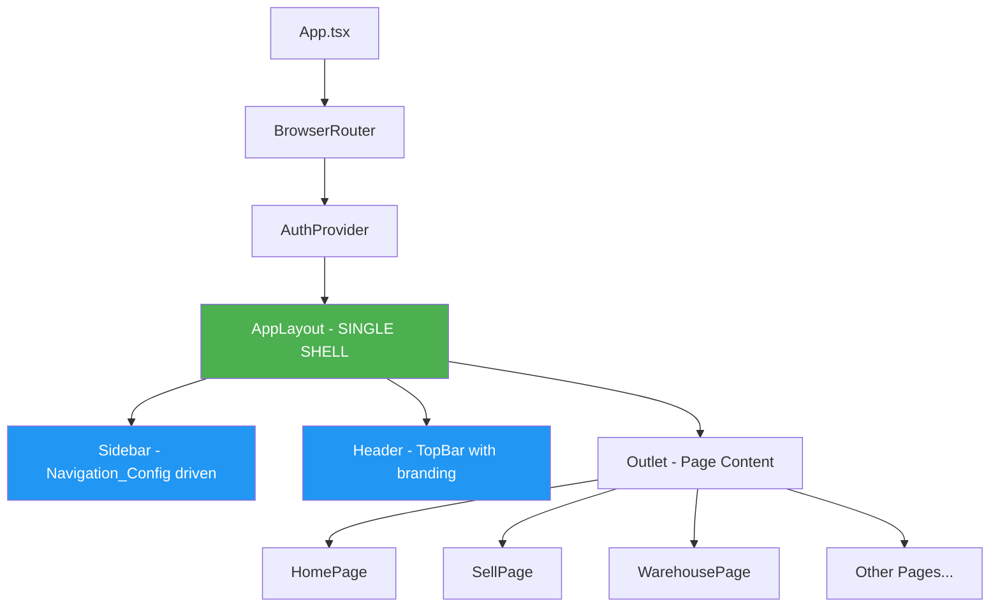

# Design Document: Navigation Consolidation

## Overview

This design addresses the consolidation of EasySale's multiple navigation systems into a single, consistent layout shell. The current state has three navigation systems rendering simultaneously (icon rail, legacy blue sidebar, modern sidebar), creating visual confusion. This design establishes AppLayout as the single source of truth for navigation, removes legacy components through quarantine (not deletion), and ensures all pages use a unified navigation experience.

Additionally, this design:
- De-CAPS the system (replaces CAPS-specific defaults with EasySale-neutral values)
- Defines clear settings scopes (User Preferences vs Store/Tenant Config vs System/Admin)
- Reorganizes navigation with Admin as a grouped section (not scattered settings)
- Implements actionable integration cards (not placeholder text)
- Enforces demo seed policy (no fake data unless DEMO_MODE)
- Provides a first-run Setup Wizard that's also re-runnable

## Architecture

### De-CAPS Defaults (EasySale-Neutral Values)

Replace any CAPS-specific defaults with EasySale-neutral values:

| Category | Default Value |
|----------|---------------|
| App name | EasySale |
| Store name (dev) | Demo Store |
| Store name (first-run) | Untitled Store |
| Station | Register 1 |
| Email domain (dev) | @EasySale.local |

**Demo Seed Users (DEMO_MODE only):**
- System Administrator — admin@EasySale.local — role: admin
- Cashier — cashier@EasySale.local — role: cashier
- Manager — manager@EasySale.local — role: manager

**Critical Rule:** Seed accounts MUST be DEMO_MODE only. In real mode:
- Show empty state + "Create first admin" wizard
- Never show pretend users or fake customers/products

### Settings Scope Classification

Every setting must be classified into one of three scopes:

| Scope | Description | Storage | UI Location |
|-------|-------------|---------|-------------|
| **User Preferences** | Per-user settings | User profile/localStorage | Profile menu → Preferences |
| **Store/Tenant Config** | Shared store settings | Backend tenant config | Admin → Store Configuration |
| **System/Admin** | Rare admin settings | Backend system config | Admin → Advanced |

**User Preferences (per user):**
- Theme choice (light/dark/system)
- UI density
- Keyboard shortcuts
- Default landing page

**Store/Tenant Configuration (shared):**
- Tax rules, pricing rules
- Locations, registers
- Branding (logo, colors)
- Integrations (WooCommerce, QuickBooks)

**System/Admin (rare):**
- Capabilities/feature flags
- Migrations, background jobs
- Logs, security policies

### Current State Analysis

The current navigation architecture has multiple overlapping systems:

```
┌─────────────────────────────────────────────────────────────────┐
│ App.tsx                                                          │
│  └─ AppLayout (provides sidebar + header)                        │
│      └─ <Outlet /> (renders page content)                        │
│          └─ HomePage / SellPage / etc.                           │
│              └─ AppShell (ALSO provides sidebar + header)        │
│                  └─ Navigation component (THIRD sidebar)         │
└─────────────────────────────────────────────────────────────────┘
```

**Problem**: Pages like `HomePage` and `SellPage` wrap their content in `AppShell` and pass `<Navigation variant="sidebar" />` as the sidebar prop, even though `AppLayout` already provides a sidebar. This creates nested/duplicate navigation.

### Target State Architecture

```
┌─────────────────────────────────────────────────────────────────┐
│ App.tsx                                                          │
│  └─ AppLayout (SINGLE source of sidebar + header)                │
│      ├─ Sidebar (from Navigation_Config)                         │
│      ├─ Header (TopBar with branding)                            │
│      └─ <Outlet /> (renders page content)                        │
│          └─ HomePage / SellPage / etc.                           │
│              └─ Page content ONLY (no AppShell with sidebar)     │
└─────────────────────────────────────────────────────────────────┘
```

### Component Hierarchy



## Components and Interfaces

### 1. AppLayout (Enhanced)

The single layout shell for all authenticated routes.

```typescript
interface AppLayoutProps {
  // No props needed - self-contained
}

// AppLayout responsibilities:
// - Renders TopBar header with branding
// - Renders sidebar navigation from Navigation_Config
// - Renders <Outlet /> for page content
// - Handles mobile sidebar toggle
// - Handles sidebar collapse state
```

### 2. Navigation Configuration

Centralized navigation definition with sections and nesting:

```typescript
interface NavigationItem {
  path: string;
  label: string;
  icon: string | LucideIcon;
  permission: Permission;
  description?: string;
  badge?: number;
  badgeKey?: string;
  capability?: string;
  section?: 'main' | 'admin';  // NEW: section grouping
}

// NEW: Navigation sections for cleaner IA
type NavigationSection = 'main' | 'admin';

// Main navigation (daily use) - top-level items
const mainNavItems: NavigationItem[] = [
  { path: '/sell', label: 'Sell', icon: 'ShoppingCart', permission: 'access_sell', section: 'main' },
  { path: '/lookup', label: 'Lookup', icon: 'Search', permission: 'access_sell', section: 'main' },
  { path: '/customers', label: 'Customers', icon: 'Users', permission: 'access_sell', section: 'main' },
  { path: '/warehouse', label: 'Warehouse', icon: 'Package', permission: 'access_warehouse', section: 'main' },
  { path: '/documents', label: 'Documents', icon: 'FileText', permission: 'access_warehouse', section: 'main' },
  { path: '/review', label: 'Review', icon: 'ClipboardCheck', permission: 'review_vendor_bills', badgeKey: 'needsReview', section: 'main' },
  { path: '/reporting', label: 'Reporting', icon: 'BarChart3', permission: 'access_admin', section: 'main' },
  { path: '/admin', label: 'Admin', icon: 'Settings', permission: 'access_admin', section: 'main' },
];

// Admin sub-navigation (inside Admin pages)
const adminSubNavItems: NavigationItem[] = [
  { path: '/admin/setup', label: 'Setup Wizard', icon: 'Wand2', permission: 'access_admin', section: 'admin' },
  { path: '/admin/users', label: 'Users & Roles', icon: 'Users', permission: 'access_admin', section: 'admin' },
  { path: '/admin/store', label: 'Store Configuration', icon: 'Store', permission: 'access_admin', section: 'admin' },
  { path: '/admin/locations', label: 'Locations & Registers', icon: 'MapPin', permission: 'access_admin', section: 'admin' },
  { path: '/admin/taxes', label: 'Taxes & Rounding', icon: 'Calculator', permission: 'access_admin', section: 'admin' },
  { path: '/admin/pricing', label: 'Pricing Rules', icon: 'DollarSign', permission: 'access_admin', section: 'admin' },
  { path: '/admin/receipts', label: 'Receipt Templates', icon: 'Receipt', permission: 'access_admin', section: 'admin' },
  { path: '/admin/branding', label: 'Branding', icon: 'Palette', permission: 'access_admin', section: 'admin' },
  { path: '/admin/integrations', label: 'Integrations', icon: 'Plug', permission: 'access_admin', section: 'admin' },
  { path: '/admin/data', label: 'Data & Imports', icon: 'Upload', permission: 'access_admin', section: 'admin' },
  { path: '/admin/exports', label: 'Exports', icon: 'Download', permission: 'access_admin', capability: 'export', section: 'admin' },
  { path: '/admin/capabilities', label: 'Capabilities', icon: 'Zap', permission: 'access_admin', section: 'admin' },
  { path: '/admin/health', label: 'System Health', icon: 'Activity', permission: 'access_admin', section: 'admin' },
  { path: '/admin/advanced', label: 'Advanced', icon: 'Shield', permission: 'access_admin', section: 'admin' },
];

// Profile menu items (top-right dropdown, NOT in sidebar)
const profileMenuItems = [
  { path: '/profile', label: 'My Profile', icon: 'User' },
  { path: '/preferences', label: 'Preferences', icon: 'Sliders' },
  { action: 'logout', label: 'Sign Out', icon: 'LogOut' },
];
```

**Key Changes:**
- Remove top-level "Settings" - personal settings go in profile menu
- Admin becomes a single entry that opens sub-navigation inside Admin pages
- Clear separation: daily use (main) vs administration (admin sub-tabs)

### 3. BrandConfig Interface

```typescript
interface BrandConfig {
  appName: string;
  company: {
    name: string;
    shortName?: string;
    icon?: string;
  };
  logo: {
    light: string;  // Path to light theme logo (PNG/JPG)
    dark: string;   // Path to dark theme logo (PNG/JPG)
  };
  favicon?: string;
  theme: {
    accentColor?: string;
    preset?: 'default' | 'blue' | 'green' | 'purple';
    defaultAppearance?: 'light' | 'dark' | 'system';  // Tenant default
  };
  store?: {
    name: string;
    station: string;
  };
}
```

### 4. Integration Card Interface

Replace placeholder "Website store here" text with actionable integration cards:

```typescript
interface IntegrationCard {
  id: string;
  name: string;
  description: string;
  status: 'connected' | 'not_connected' | 'error' | 'syncing';
  icon: string;
  config?: {
    storeUrl?: string;
    lastSync?: string;
    errorMessage?: string;
  };
  actions: {
    connect: () => void;
    configure: () => void;
    testConnection: () => void;
    disconnect: () => void;
  };
}

// Example: WooCommerce integration card
const wooCommerceCard: IntegrationCard = {
  id: 'woocommerce',
  name: 'WooCommerce',
  description: 'Sync products, pricing, and orders with your online store',
  status: 'not_connected',
  icon: 'ShoppingBag',
  actions: { /* ... */ }
};
```

**Empty State for Disconnected Integrations:**
```
┌─────────────────────────────────────────────┐
│  🛒 WooCommerce                    [Connect]│
│                                             │
│  Connect your store to sync products,       │
│  pricing, and orders.                       │
│                                             │
│  Status: Not connected                      │
└─────────────────────────────────────────────┘
```

### 5. Setup Wizard Interface

First-run wizard that's also re-runnable from Admin → Setup Wizard:

```typescript
interface SetupWizardStep {
  id: string;
  title: string;
  description: string;
  component: React.ComponentType;
  isRequired: boolean;
  isComplete: boolean;
}

const setupWizardSteps: SetupWizardStep[] = [
  { id: 'admin', title: 'Create First Admin', description: 'Set up administrator account', isRequired: true },
  { id: 'store', title: 'Store Basics', description: 'Name, currency, locale', isRequired: true },
  { id: 'taxes', title: 'Taxes', description: 'GST/PST/HST or custom rates', isRequired: true },
  { id: 'locations', title: 'Locations & Registers', description: 'Set up your store locations', isRequired: true },
  { id: 'branding', title: 'Branding', description: 'Upload logo and set colors', isRequired: false },
  { id: 'integrations', title: 'Integrations', description: 'Connect WooCommerce, etc.', isRequired: false },
  { id: 'import', title: 'Import Data', description: 'Import products and customers', isRequired: false },
  { id: 'test', title: 'Test Sale', description: 'Verify printer/scanner setup', isRequired: false },
];
```

**Wizard Completion Screen:**
- "Store is ready" message
- Link to Sell screen
- "What's next" suggestions (import products, connect store, configure receipts)

### 6. Route Registry

```typescript
interface RouteEntry {
  path: string;
  component: string;
  layout: 'AppLayout' | 'none';
  status: 'active' | 'legacy' | 'quarantined';
  navSection: 'main' | 'admin' | 'profile' | 'none';
  permissions?: Permission[];
}

// Single source of truth for audits + preventing old pages from reappearing
const routeRegistry: RouteEntry[] = [
  { path: '/sell', component: 'SellPage', layout: 'AppLayout', status: 'active', navSection: 'main' },
  { path: '/admin', component: 'AdminPage', layout: 'AppLayout', status: 'active', navSection: 'main' },
  { path: '/admin/setup', component: 'SetupWizardPage', layout: 'AppLayout', status: 'active', navSection: 'admin' },
  // ... etc
];
```

### 7. Page Component Pattern (No Nested Shell)

Pages should NOT wrap content in AppShell with sidebar:

```typescript
// ❌ WRONG - Creates duplicate navigation
export function SellPage() {
  return (
    <AppShell
      sidebar={<Navigation variant="sidebar" />}
      header={<PageHeader title="Point of Sale" />}
    >
      <PageContent />
    </AppShell>
  );
}

// ✅ CORRECT - Page content only
export function SellPage() {
  return (
    <div className="page-content">
      <PageHeader title="Point of Sale" />
      <PageContent />
    </div>
  );
}
```

## Data Models

### Quarantine Mapping

```typescript
interface QuarantineEntry {
  oldPath: string;
  newPath: string;
  reason: string;
  replacement?: string;
  lastKnownRoute?: string;
  quarantinedAt: string;
}

// Example entries
const quarantineMap: QuarantineEntry[] = [
  {
    oldPath: 'frontend/src/components/LegacySidebar.tsx',
    newPath: 'frontend/src/legacy_quarantine/LegacySidebar.tsx',
    reason: 'Replaced by AppLayout sidebar using Navigation_Config',
    replacement: 'frontend/src/AppLayout.tsx',
    quarantinedAt: '2026-01-XX'
  }
];
```

### Route Registry

```typescript
interface RouteEntry {
  path: string;
  component: string;
  layout: 'AppLayout' | 'none';
  status: 'active' | 'legacy' | 'quarantined';
  permissions?: Permission[];
}
```

## Correctness Properties

*A property is a characteristic or behavior that should hold true across all valid executions of a system—essentially, a formal statement about what the system should do. Properties serve as the bridge between human-readable specifications and machine-verifiable correctness guarantees.*

### Property 1: Single Navigation Instance

*For any* authenticated route and any viewport size, exactly one sidebar navigation component SHALL be rendered in the DOM.

**Validates: Requirements 2.1, 2.2, 3.1**

### Property 2: Navigation Configuration Consistency

*For any* navigation item in Navigation_Config, if the user has the required permission AND the required capability is enabled, then that item SHALL appear in the rendered navigation.

**Validates: Requirements 3.4, 3.5, 3.6**

### Property 3: Route-Navigation Synchronization

*For any* route change, the navigation active state SHALL update to highlight the current route within one render cycle.

**Validates: Requirements 3.7**

### Property 4: No Legacy Components in Active Tree

*For any* component in the active render tree, that component SHALL NOT be imported from the `legacy_quarantine` directory.

**Validates: Requirements 4.2, 14.3**

### Property 5: Design Token Usage

*For any* navigation styling property (background, text, border, spacing), the value SHALL reference a design token variable, not a hardcoded color or pixel value.

**Validates: Requirements 5.1, 5.2, 5.3**

### Property 6: Brand Configuration Completeness

*For any* valid BrandConfig object, the rendered header SHALL display the configured appName and logo.

**Validates: Requirements 6.1, 6.2**

### Property 7: Empty State vs Mock Data

*For any* page that fetches data from the backend, if the API returns an empty result, the page SHALL render an empty state component, not mock/placeholder data.

**Validates: Requirements 9.1, 9.3**

### Property 8: Settings Scope Correctness

*For any* setting in the system, user preferences SHALL be stored per-user (not as tenant config), and tenant config SHALL be stored at tenant level (not per-user).

**Validates: Requirements 7.1, 7.3**

### Property 9: No Demo Data in Production Mode

*For any* page render when DEMO_MODE is false, seed fixtures SHALL NOT be loaded and demo users SHALL NOT appear in the system.

**Validates: Requirements 8.1, 9.2, 9.3**

## Error Handling

### Navigation Load Failures

```typescript
// If navigation config fails to load, show minimal fallback
const fallbackNavigation: NavigationItem[] = [
  { path: '/', label: 'Home', icon: 'Home', permission: 'access_sell' },
];

// Error boundary for navigation
<ErrorBoundary fallback={<FallbackNavigation items={fallbackNavigation} />}>
  <Navigation />
</ErrorBoundary>
```

### Permission/Capability Check Failures

```typescript
// If permission check fails, hide item (fail closed)
// If capability check fails, hide item (fail closed)
// Log errors for debugging but don't crash UI
```

### Brand Asset Load Failures

```typescript
// If logo fails to load, show text fallback (company shortName or first 2 letters)
// If favicon fails, use default
```

## Testing Strategy

### Unit Tests

Unit tests verify specific examples and edge cases:

1. **Navigation filtering**: Test that items are correctly filtered by permission
2. **Active state**: Test that correct item is highlighted for each route
3. **Brand config parsing**: Test valid and invalid configurations
4. **Quarantine isolation**: Test that quarantined imports are detected

### Property-Based Tests

Property-based tests verify universal properties across all inputs. Each property test MUST run minimum 100 iterations.

**Property Test Configuration:**
- Framework: Vitest with fast-check
- Minimum iterations: 100 per property
- Tag format: `Feature: navigation-consolidation, Property N: {property_text}`

**Property Tests to Implement:**

1. **Property 1 Test**: Generate random route paths and viewport sizes, verify exactly one sidebar renders
2. **Property 2 Test**: Generate random permission sets and capability states, verify navigation items match expected visibility
3. **Property 3 Test**: Generate random route sequences, verify active state updates correctly
4. **Property 4 Test**: Static analysis test - scan imports for legacy_quarantine references
5. **Property 5 Test**: Generate random navigation states, verify all style values are token references
6. **Property 6 Test**: Generate random valid BrandConfig objects, verify header renders correctly
7. **Property 7 Test**: Generate random API response states (empty/populated), verify correct rendering

### Integration Tests

1. **Full navigation flow**: Navigate through all routes, verify consistent navigation
2. **Permission changes**: Change user permissions, verify navigation updates
3. **Theme switching**: Switch themes, verify navigation styling updates
4. **Mobile responsive**: Test sidebar collapse/expand on mobile

### Visual Regression Tests

1. **Navigation appearance**: Capture screenshots of navigation in various states
2. **Brand variations**: Test different brand configurations
3. **Theme variations**: Test light/dark themes

## Migration Strategy

### Phase 1: Audit and Document

1. Create `audit/ROUTES_FRONTEND.md`
2. Create `audit/NAV_MOUNTS.md`
3. Create `audit/LEGACY_UI_MAP.md`

### Phase 2: Quarantine Legacy Code

1. Create `frontend/src/legacy_quarantine/` directory
2. Move legacy navigation components (DO NOT DELETE)
3. Update quarantine mapping documentation

### Phase 3: Update Pages

1. Remove AppShell wrapper with sidebar from pages
2. Update pages to render content only
3. Ensure AppLayout provides all navigation

### Phase 4: Verify and Clean

1. Run property tests
2. Run visual regression tests
3. Verify no legacy imports in active code
4. Update documentation

## File Changes Summary

### Files to Modify

| File | Change |
|------|--------|
| `frontend/src/AppLayout.tsx` | Ensure single sidebar, add branding support |
| `frontend/src/features/home/pages/HomePage.tsx` | Remove AppShell wrapper with sidebar |
| `frontend/src/features/sell/pages/SellPage.tsx` | Remove AppShell wrapper with sidebar |
| `frontend/src/features/warehouse/pages/WarehousePage.tsx` | Remove AppShell wrapper with sidebar |
| Other page files | Remove AppShell wrapper with sidebar |

### Files to Create

| File | Purpose |
|------|---------|
| `frontend/src/legacy_quarantine/` | Directory for quarantined legacy code |
| `audit/ROUTES_FRONTEND.md` | Route audit documentation |
| `audit/NAV_MOUNTS.md` | Navigation mount audit |
| `audit/LEGACY_UI_MAP.md` | Legacy component mapping |
| `audit/SETTINGS_MATRIX.md` | Settings scope + storage + UI location |
| `audit/BRANDING_ASSETS.md` | Logo/favicon pipeline + supported formats |
| `docs/ui/layout_hierarchy.md` | Layout hierarchy documentation |
| `docs/ui/USED_COMPONENTS.md` | Active component documentation |
| `docs/ui/LEGACY_QUARANTINE.md` | Quarantine documentation |
| `docs/ui/NAV_CONFIG.md` | Navigation configuration documentation |
| `docs/ui/INFORMATION_ARCHITECTURE.md` | Final grouping + rationale |
| `frontend/src/features/admin/pages/SetupWizardPage.tsx` | First-run + re-runnable setup wizard |
| `frontend/src/features/admin/components/IntegrationCard.tsx` | Actionable integration card component |
| `frontend/src/common/components/ProfileMenu.tsx` | Profile dropdown with preferences |

### Files to Quarantine (NOT DELETE)

| Current Location | Quarantine Location | Reason |
|-----------------|---------------------|--------|
| Any legacy blue sidebar CSS | `legacy_quarantine/styles/` | Replaced by token-based styling |
| Any duplicate navigation components | `legacy_quarantine/components/` | Consolidated into AppLayout |


## Information Architecture Summary

### Top-Level Navigation (Daily Use)

| Item | Path | Permission | Description |
|------|------|------------|-------------|
| Sell | /sell | access_sell | Point of sale checkout |
| Lookup | /lookup | access_sell | Product search |
| Customers | /customers | access_sell | Customer management |
| Warehouse | /warehouse | access_warehouse | Inventory management |
| Documents | /documents | access_warehouse | OCR and document processing |
| Review | /review | review_vendor_bills | Vendor bill review (with badge) |
| Reporting | /reporting | access_admin | Sales reports and analytics |
| Admin | /admin | access_admin | Opens admin sub-navigation |

### Admin Sub-Navigation (Inside Admin Pages)

| Section | Items |
|---------|-------|
| **Setup** | Setup Wizard |
| **Users** | Users & Roles |
| **Store** | Store Configuration, Locations & Registers, Taxes & Rounding, Pricing Rules, Receipt Templates |
| **Branding** | Logo, Colors, Favicon |
| **Integrations** | WooCommerce, QuickBooks, Other connectors |
| **Data** | Data & Imports, Exports |
| **System** | Capabilities, System Health, Advanced |

### Profile Menu (Top-Right Dropdown)

| Item | Action |
|------|--------|
| My Profile | Opens profile page |
| Preferences | Theme, density, shortcuts |
| Sign Out | Logout |

### Theme Configuration

| Level | Setting | Options |
|-------|---------|---------|
| Tenant Default | Admin → Branding | Light / Dark / System |
| User Override | Profile → Preferences | Light / Dark / Use store default |

## Demo Mode Policy

```typescript
// Environment check
const isDemoMode = process.env.DEMO_MODE === 'true';

// Seed data loading
if (isDemoMode) {
  // Load demo users, products, customers
  // Show "DEMO MODE" indicator in UI
} else {
  // Show empty states
  // Require first-run wizard
  // No fake data
}
```

**Demo Mode Indicator:**
- Visible banner when DEMO_MODE=true
- Clear labeling that data is not real
- Easy to distinguish from production
