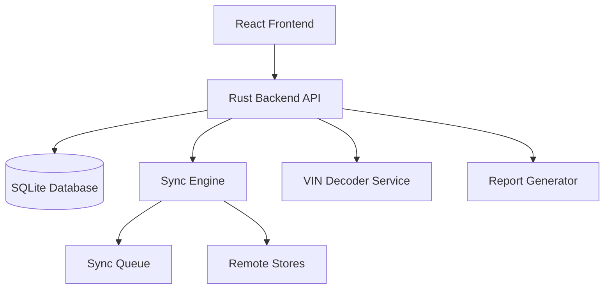

# Design Document: Sales & Customer Management

## Overview

This design document specifies the architecture and implementation approach for the Sales & Customer Management module of the CAPS POS system. The module extends the core transaction processing with advanced features including layaways, service orders, commission tracking, customer-based pricing, loyalty programs, credit account management, gift cards, VIN/vehicle lookup, promotions, and comprehensive reporting.

The design maintains the offline-first architecture using SQLite for local storage with background synchronization between stores. All features must operate fully offline with conflict resolution handled during sync. The implementation uses Rust for the backend API and TypeScript/React for the frontend UI.

## Architecture

### System Components



### Data Flow

1. **Transaction Creation**: UI → API → SQLite (immediate local storage)
2. **Sync Process**: Sync Engine → Queue → Remote Stores (background, every 1-5 minutes)
3. **Conflict Resolution**: Remote Changes → Sync Engine → Conflict Resolver → SQLite
4. **Reporting**: UI Request → API → SQLite Query → Report Generator → UI

### Offline-First Principles

- All CRUD operations write to local SQLite first
- Background sync process replicates changes to other stores
- Conflict resolution uses timestamp + store_id for deterministic outcomes
- Queue persists failed syncs with exponential backoff retry
- UI displays sync status and pending operation count


## Components and Interfaces

### 1. Customer Management Component

**Responsibilities:**
- Customer CRUD operations
- Pricing tier assignment
- Loyalty points tracking
- Credit account management
- Vehicle registration and service history

**Key Interfaces:**

```rust
// Customer model
struct Customer {
    id: String,
    name: String,
    email: Option<String>,
    phone: Option<String>,
    pricing_tier: PricingTier,
    loyalty_points: i32,
    store_credit: Decimal,
    credit_limit: Option<Decimal>,
    credit_balance: Decimal,
    created_at: String,
    updated_at: String,
    sync_version: i64,
    store_id: String,
}

enum PricingTier {
    Retail,
    Wholesale,
    Contractor,
    VIP,
}

// Vehicle model
struct Vehicle {
    id: String,
    customer_id: String,
    vin: Option<String>,
    make: String,
    model: String,
    year: i32,
    engine: Option<String>,
    trim: Option<String>,
    created_at: String,
}
```


### 2. Layaway Management Component

**Responsibilities:**
- Create and track layaway transactions
- Process payments and update balances
- Reserve inventory for layaway items
- Handle layaway completion or cancellation
- Generate payment reminders

**Key Interfaces:**

```rust
struct Layaway {
    id: String,
    customer_id: String,
    status: LayawayStatus,
    total_amount: Decimal,
    deposit_amount: Decimal,
    balance_due: Decimal,
    due_date: Option<String>,
    created_at: String,
    updated_at: String,
    completed_at: Option<String>,
    sync_version: i64,
    store_id: String,
}

enum LayawayStatus {
    Active,
    Completed,
    Cancelled,
    Overdue,
}

struct LayawayItem {
    id: String,
    layaway_id: String,
    product_id: String,
    quantity: Decimal,
    unit_price: Decimal,
    total_price: Decimal,
}

struct LayawayPayment {
    id: String,
    layaway_id: String,
    amount: Decimal,
    payment_method: String,
    payment_date: String,
    employee_id: String,
}
```


### 3. Work Order & Service Component

**Responsibilities:**
- Create and manage work orders
- Track labor, parts, and materials
- Calculate service charges
- Maintain vehicle service history
- Handle warranty tracking

**Key Interfaces:**

```rust
struct WorkOrder {
    id: String,
    work_order_number: String,
    customer_id: String,
    vehicle_id: String,
    status: WorkOrderStatus,
    description: String,
    estimated_total: Option<Decimal>,
    actual_total: Option<Decimal>,
    labor_total: Decimal,
    parts_total: Decimal,
    created_at: String,
    updated_at: String,
    completed_at: Option<String>,
    invoiced_at: Option<String>,
    assigned_technician_id: Option<String>,
    is_warranty: bool,
    sync_version: i64,
    store_id: String,
}

enum WorkOrderStatus {
    Created,
    Estimate,
    Approved,
    InProgress,
    Completed,
    Invoiced,
    Cancelled,
}

struct WorkOrderLine {
    id: String,
    work_order_id: String,
    line_type: WorkOrderLineType,
    product_id: Option<String>,
    description: String,
    quantity: Decimal,
    unit_price: Decimal,
    total_price: Decimal,
    is_warranty: bool,
}

enum WorkOrderLineType {
    Labor,
    Part,
    Paint,
    Miscellaneous,
}
```


### 4. Commission Tracking Component

**Responsibilities:**
- Calculate commissions based on configured rules
- Track employee sales performance
- Handle commission adjustments for returns
- Support split commissions
- Generate commission reports

**Key Interfaces:**

```rust
struct CommissionRule {
    id: String,
    name: String,
    rule_type: CommissionRuleType,
    rate: Decimal,
    min_profit_threshold: Option<Decimal>,
    applies_to_categories: Option<Vec<String>>,
    applies_to_products: Option<Vec<String>>,
    is_active: bool,
}

enum CommissionRuleType {
    PercentOfSale,
    PercentOfProfit,
    FlatRatePerItem,
}

struct Commission {
    id: String,
    employee_id: String,
    transaction_id: String,
    rule_id: String,
    sale_amount: Decimal,
    profit_amount: Decimal,
    commission_amount: Decimal,
    created_at: String,
    is_reversed: bool,
}

struct CommissionSplit {
    id: String,
    commission_id: String,
    employee_id: String,
    split_percentage: Decimal,
    split_amount: Decimal,
}
```


### 5. Loyalty & Rewards Component

**Responsibilities:**
- Calculate and award loyalty points
- Process point redemptions
- Track point history
- Manage store credit balances
- Handle gift card operations

**Key Interfaces:**

```rust
struct LoyaltyTransaction {
    id: String,
    customer_id: String,
    transaction_type: LoyaltyTransactionType,
    points: i32,
    amount: Option<Decimal>,
    reference_id: Option<String>,
    created_at: String,
    employee_id: String,
}

enum LoyaltyTransactionType {
    Earned,
    Redeemed,
    Adjusted,
    Expired,
}

struct GiftCard {
    id: String,
    card_number: String,
    initial_balance: Decimal,
    current_balance: Decimal,
    status: GiftCardStatus,
    issued_date: String,
    expiry_date: Option<String>,
    customer_id: Option<String>,
}

enum GiftCardStatus {
    Active,
    Depleted,
    Expired,
    Cancelled,
}

struct GiftCardTransaction {
    id: String,
    gift_card_id: String,
    transaction_type: GiftCardTransactionType,
    amount: Decimal,
    reference_id: Option<String>,
    created_at: String,
}

enum GiftCardTransactionType {
    Issued,
    Reloaded,
    Redeemed,
    Refunded,
}
```


### 6. Credit Account Component

**Responsibilities:**
- Manage customer credit limits and balances
- Process credit purchases and payments
- Generate AR statements
- Calculate aging and service charges
- Enforce credit limits

**Key Interfaces:**

```rust
struct CreditAccount {
    id: String,
    customer_id: String,
    credit_limit: Decimal,
    current_balance: Decimal,
    available_credit: Decimal,
    payment_terms_days: i32,
    service_charge_rate: Option<Decimal>,
    is_active: bool,
    last_statement_date: Option<String>,
    created_at: String,
    updated_at: String,
}

struct CreditTransaction {
    id: String,
    credit_account_id: String,
    transaction_type: CreditTransactionType,
    amount: Decimal,
    reference_id: String,
    transaction_date: String,
    due_date: Option<String>,
    days_overdue: i32,
}

enum CreditTransactionType {
    Charge,
    Payment,
    ServiceCharge,
    Adjustment,
}

struct ARStatement {
    id: String,
    credit_account_id: String,
    statement_date: String,
    previous_balance: Decimal,
    charges: Decimal,
    payments: Decimal,
    service_charges: Decimal,
    current_balance: Decimal,
    aging_current: Decimal,
    aging_30: Decimal,
    aging_60: Decimal,
    aging_90_plus: Decimal,
}
```


### 7. Promotion & Pricing Component

**Responsibilities:**
- Manage promotional campaigns
- Apply automatic discounts
- Calculate best available pricing
- Track promotion effectiveness
- Handle customer-specific pricing

**Key Interfaces:**

```rust
struct Promotion {
    id: String,
    name: String,
    description: String,
    promotion_type: PromotionType,
    discount_value: Decimal,
    start_date: String,
    end_date: String,
    applies_to_categories: Option<Vec<String>>,
    applies_to_products: Option<Vec<String>>,
    applies_to_tiers: Option<Vec<PricingTier>>,
    min_quantity: Option<i32>,
    is_active: bool,
}

enum PromotionType {
    PercentageOff,
    FixedAmountOff,
    BuyXGetY,
    QuantityDiscount,
}

struct PromotionUsage {
    id: String,
    promotion_id: String,
    transaction_id: String,
    customer_id: Option<String>,
    discount_amount: Decimal,
    items_affected: i32,
    created_at: String,
}

struct PriceLevel {
    id: String,
    product_id: String,
    pricing_tier: PricingTier,
    price: Decimal,
    markup_percentage: Option<Decimal>,
}
```


## Data Models

### Database Schema

The following tables will be added to the existing SQLite database:

```sql
-- Customers table
CREATE TABLE customers (
    id TEXT PRIMARY KEY,
    name TEXT NOT NULL,
    email TEXT,
    phone TEXT,
    pricing_tier TEXT NOT NULL DEFAULT 'Retail',
    loyalty_points INTEGER NOT NULL DEFAULT 0,
    store_credit REAL NOT NULL DEFAULT 0.0,
    credit_limit REAL,
    credit_balance REAL NOT NULL DEFAULT 0.0,
    created_at TEXT NOT NULL,
    updated_at TEXT NOT NULL,
    sync_version INTEGER NOT NULL DEFAULT 0,
    store_id TEXT NOT NULL
);

CREATE INDEX idx_customers_email ON customers(email);
CREATE INDEX idx_customers_phone ON customers(phone);
CREATE INDEX idx_customers_pricing_tier ON customers(pricing_tier);

-- Vehicles table
CREATE TABLE vehicles (
    id TEXT PRIMARY KEY,
    customer_id TEXT NOT NULL,
    vin TEXT,
    make TEXT NOT NULL,
    model TEXT NOT NULL,
    year INTEGER NOT NULL,
    engine TEXT,
    trim TEXT,
    created_at TEXT NOT NULL,
    FOREIGN KEY (customer_id) REFERENCES customers(id) ON DELETE CASCADE
);

CREATE INDEX idx_vehicles_customer_id ON vehicles(customer_id);
CREATE INDEX idx_vehicles_vin ON vehicles(vin);

-- Layaways table
CREATE TABLE layaways (
    id TEXT PRIMARY KEY,
    customer_id TEXT NOT NULL,
    status TEXT NOT NULL,
    total_amount REAL NOT NULL,
    deposit_amount REAL NOT NULL,
    balance_due REAL NOT NULL,
    due_date TEXT,
    created_at TEXT NOT NULL,
    updated_at TEXT NOT NULL,
    completed_at TEXT,
    sync_version INTEGER NOT NULL DEFAULT 0,
    store_id TEXT NOT NULL,
    FOREIGN KEY (customer_id) REFERENCES customers(id)
);

CREATE INDEX idx_layaways_customer_id ON layaways(customer_id);
CREATE INDEX idx_layaways_status ON layaways(status);
CREATE INDEX idx_layaways_due_date ON layaways(due_date);
```


-- Layaway items table
CREATE TABLE layaway_items (
    id TEXT PRIMARY KEY,
    layaway_id TEXT NOT NULL,
    product_id TEXT NOT NULL,
    quantity REAL NOT NULL,
    unit_price REAL NOT NULL,
    total_price REAL NOT NULL,
    FOREIGN KEY (layaway_id) REFERENCES layaways(id) ON DELETE CASCADE
);

CREATE INDEX idx_layaway_items_layaway_id ON layaway_items(layaway_id);

-- Layaway payments table
CREATE TABLE layaway_payments (
    id TEXT PRIMARY KEY,
    layaway_id TEXT NOT NULL,
    amount REAL NOT NULL,
    payment_method TEXT NOT NULL,
    payment_date TEXT NOT NULL,
    employee_id TEXT NOT NULL,
    FOREIGN KEY (layaway_id) REFERENCES layaways(id) ON DELETE CASCADE,
    FOREIGN KEY (employee_id) REFERENCES users(id)
);

CREATE INDEX idx_layaway_payments_layaway_id ON layaway_payments(layaway_id);

-- Work orders table
CREATE TABLE work_orders (
    id TEXT PRIMARY KEY,
    work_order_number TEXT NOT NULL UNIQUE,
    customer_id TEXT NOT NULL,
    vehicle_id TEXT NOT NULL,
    status TEXT NOT NULL,
    description TEXT NOT NULL,
    estimated_total REAL,
    actual_total REAL,
    labor_total REAL NOT NULL DEFAULT 0.0,
    parts_total REAL NOT NULL DEFAULT 0.0,
    created_at TEXT NOT NULL,
    updated_at TEXT NOT NULL,
    completed_at TEXT,
    invoiced_at TEXT,
    assigned_technician_id TEXT,
    is_warranty INTEGER NOT NULL DEFAULT 0,
    sync_version INTEGER NOT NULL DEFAULT 0,
    store_id TEXT NOT NULL,
    FOREIGN KEY (customer_id) REFERENCES customers(id),
    FOREIGN KEY (vehicle_id) REFERENCES vehicles(id),
    FOREIGN KEY (assigned_technician_id) REFERENCES users(id)
);

CREATE INDEX idx_work_orders_customer_id ON work_orders(customer_id);
CREATE INDEX idx_work_orders_vehicle_id ON work_orders(vehicle_id);
CREATE INDEX idx_work_orders_status ON work_orders(status);
CREATE INDEX idx_work_orders_number ON work_orders(work_order_number);
```


-- Work order lines table
CREATE TABLE work_order_lines (
    id TEXT PRIMARY KEY,
    work_order_id TEXT NOT NULL,
    line_type TEXT NOT NULL,
    product_id TEXT,
    description TEXT NOT NULL,
    quantity REAL NOT NULL,
    unit_price REAL NOT NULL,
    total_price REAL NOT NULL,
    is_warranty INTEGER NOT NULL DEFAULT 0,
    FOREIGN KEY (work_order_id) REFERENCES work_orders(id) ON DELETE CASCADE
);

CREATE INDEX idx_work_order_lines_work_order_id ON work_order_lines(work_order_id);

-- Commission rules table
CREATE TABLE commission_rules (
    id TEXT PRIMARY KEY,
    name TEXT NOT NULL,
    rule_type TEXT NOT NULL,
    rate REAL NOT NULL,
    min_profit_threshold REAL,
    applies_to_categories TEXT,
    applies_to_products TEXT,
    is_active INTEGER NOT NULL DEFAULT 1
);

-- Commissions table
CREATE TABLE commissions (
    id TEXT PRIMARY KEY,
    employee_id TEXT NOT NULL,
    transaction_id TEXT NOT NULL,
    rule_id TEXT NOT NULL,
    sale_amount REAL NOT NULL,
    profit_amount REAL NOT NULL,
    commission_amount REAL NOT NULL,
    created_at TEXT NOT NULL,
    is_reversed INTEGER NOT NULL DEFAULT 0,
    FOREIGN KEY (employee_id) REFERENCES users(id),
    FOREIGN KEY (rule_id) REFERENCES commission_rules(id)
);

CREATE INDEX idx_commissions_employee_id ON commissions(employee_id);
CREATE INDEX idx_commissions_transaction_id ON commissions(transaction_id);
CREATE INDEX idx_commissions_created_at ON commissions(created_at);

-- Commission splits table
CREATE TABLE commission_splits (
    id TEXT PRIMARY KEY,
    commission_id TEXT NOT NULL,
    employee_id TEXT NOT NULL,
    split_percentage REAL NOT NULL,
    split_amount REAL NOT NULL,
    FOREIGN KEY (commission_id) REFERENCES commissions(id) ON DELETE CASCADE,
    FOREIGN KEY (employee_id) REFERENCES users(id)
);

CREATE INDEX idx_commission_splits_commission_id ON commission_splits(commission_id);
CREATE INDEX idx_commission_splits_employee_id ON commission_splits(employee_id);
```


-- Loyalty transactions table
CREATE TABLE loyalty_transactions (
    id TEXT PRIMARY KEY,
    customer_id TEXT NOT NULL,
    transaction_type TEXT NOT NULL,
    points INTEGER NOT NULL,
    amount REAL,
    reference_id TEXT,
    created_at TEXT NOT NULL,
    employee_id TEXT NOT NULL,
    FOREIGN KEY (customer_id) REFERENCES customers(id),
    FOREIGN KEY (employee_id) REFERENCES users(id)
);

CREATE INDEX idx_loyalty_transactions_customer_id ON loyalty_transactions(customer_id);
CREATE INDEX idx_loyalty_transactions_created_at ON loyalty_transactions(created_at);

-- Gift cards table
CREATE TABLE gift_cards (
    id TEXT PRIMARY KEY,
    card_number TEXT NOT NULL UNIQUE,
    initial_balance REAL NOT NULL,
    current_balance REAL NOT NULL,
    status TEXT NOT NULL,
    issued_date TEXT NOT NULL,
    expiry_date TEXT,
    customer_id TEXT,
    FOREIGN KEY (customer_id) REFERENCES customers(id)
);

CREATE INDEX idx_gift_cards_card_number ON gift_cards(card_number);
CREATE INDEX idx_gift_cards_customer_id ON gift_cards(customer_id);

-- Gift card transactions table
CREATE TABLE gift_card_transactions (
    id TEXT PRIMARY KEY,
    gift_card_id TEXT NOT NULL,
    transaction_type TEXT NOT NULL,
    amount REAL NOT NULL,
    reference_id TEXT,
    created_at TEXT NOT NULL,
    FOREIGN KEY (gift_card_id) REFERENCES gift_cards(id) ON DELETE CASCADE
);

CREATE INDEX idx_gift_card_transactions_gift_card_id ON gift_card_transactions(gift_card_id);

-- Credit accounts table
CREATE TABLE credit_accounts (
    id TEXT PRIMARY KEY,
    customer_id TEXT NOT NULL UNIQUE,
    credit_limit REAL NOT NULL,
    current_balance REAL NOT NULL DEFAULT 0.0,
    available_credit REAL NOT NULL,
    payment_terms_days INTEGER NOT NULL DEFAULT 30,
    service_charge_rate REAL,
    is_active INTEGER NOT NULL DEFAULT 1,
    last_statement_date TEXT,
    created_at TEXT NOT NULL,
    updated_at TEXT NOT NULL,
    FOREIGN KEY (customer_id) REFERENCES customers(id) ON DELETE CASCADE
);

CREATE INDEX idx_credit_accounts_customer_id ON credit_accounts(customer_id);
```


-- Credit transactions table
CREATE TABLE credit_transactions (
    id TEXT PRIMARY KEY,
    credit_account_id TEXT NOT NULL,
    transaction_type TEXT NOT NULL,
    amount REAL NOT NULL,
    reference_id TEXT NOT NULL,
    transaction_date TEXT NOT NULL,
    due_date TEXT,
    days_overdue INTEGER NOT NULL DEFAULT 0,
    FOREIGN KEY (credit_account_id) REFERENCES credit_accounts(id) ON DELETE CASCADE
);

CREATE INDEX idx_credit_transactions_account_id ON credit_transactions(credit_account_id);
CREATE INDEX idx_credit_transactions_due_date ON credit_transactions(due_date);

-- AR statements table
CREATE TABLE ar_statements (
    id TEXT PRIMARY KEY,
    credit_account_id TEXT NOT NULL,
    statement_date TEXT NOT NULL,
    previous_balance REAL NOT NULL,
    charges REAL NOT NULL,
    payments REAL NOT NULL,
    service_charges REAL NOT NULL,
    current_balance REAL NOT NULL,
    aging_current REAL NOT NULL,
    aging_30 REAL NOT NULL,
    aging_60 REAL NOT NULL,
    aging_90_plus REAL NOT NULL,
    FOREIGN KEY (credit_account_id) REFERENCES credit_accounts(id) ON DELETE CASCADE
);

CREATE INDEX idx_ar_statements_account_id ON ar_statements(credit_account_id);
CREATE INDEX idx_ar_statements_date ON ar_statements(statement_date);

-- Promotions table
CREATE TABLE promotions (
    id TEXT PRIMARY KEY,
    name TEXT NOT NULL,
    description TEXT,
    promotion_type TEXT NOT NULL,
    discount_value REAL NOT NULL,
    start_date TEXT NOT NULL,
    end_date TEXT NOT NULL,
    applies_to_categories TEXT,
    applies_to_products TEXT,
    applies_to_tiers TEXT,
    min_quantity INTEGER,
    is_active INTEGER NOT NULL DEFAULT 1
);

CREATE INDEX idx_promotions_dates ON promotions(start_date, end_date);
CREATE INDEX idx_promotions_active ON promotions(is_active);

-- Promotion usage table
CREATE TABLE promotion_usage (
    id TEXT PRIMARY KEY,
    promotion_id TEXT NOT NULL,
    transaction_id TEXT NOT NULL,
    customer_id TEXT,
    discount_amount REAL NOT NULL,
    items_affected INTEGER NOT NULL,
    created_at TEXT NOT NULL,
    FOREIGN KEY (promotion_id) REFERENCES promotions(id),
    FOREIGN KEY (customer_id) REFERENCES customers(id)
);

CREATE INDEX idx_promotion_usage_promotion_id ON promotion_usage(promotion_id);
CREATE INDEX idx_promotion_usage_created_at ON promotion_usage(created_at);
```


-- Price levels table
CREATE TABLE price_levels (
    id TEXT PRIMARY KEY,
    product_id TEXT NOT NULL,
    pricing_tier TEXT NOT NULL,
    price REAL NOT NULL,
    markup_percentage REAL
);

CREATE INDEX idx_price_levels_product_id ON price_levels(product_id);
CREATE INDEX idx_price_levels_tier ON price_levels(pricing_tier);
```

### Sync Metadata

All tables that require synchronization include:
- `sync_version`: Incremented on each update for optimistic locking
- `store_id`: Identifies which store created/last modified the record
- `updated_at`: Timestamp for conflict resolution

## Correctness Properties

*A property is a characteristic or behavior that should hold true across all valid executions of a system—essentially, a formal statement about what the system should do. Properties serve as the bridge between human-readable specifications and machine-verifiable correctness guarantees.*


### Core Properties

Property 1: Layaway balance consistency
*For any* layaway and payment amount, when a payment is recorded, the new balance should equal the previous balance minus the payment amount, and a payment record should exist in the payment history
**Validates: Requirements 1.3**

Property 2: Layaway completion triggers sale conversion
*For any* layaway, when the balance reaches zero, the status should change to "Completed" and reserved inventory should be released for pickup
**Validates: Requirements 1.4**

Property 3: Layaway cancellation restores inventory
*For any* cancelled layaway, all reserved items should be returned to available inventory
**Validates: Requirements 1.5**

Property 4: Work order number uniqueness
*For any* two work orders, their work order numbers should be different
**Validates: Requirements 2.3**

Property 5: Labor charge calculation
*For any* labor rate and time duration, the calculated charge should equal rate multiplied by duration
**Validates: Requirements 2.4**

Property 6: Work order completion creates invoice
*For any* work order, when its status changes to "Completed", an invoice should be created and inventory should be updated for all consumed parts
**Validates: Requirements 2.6**

Property 7: Commission calculation correctness
*For any* sale and commission rule, the calculated commission should match the rule type: for PercentOfSale, commission equals sale amount times rate; for PercentOfProfit, commission equals profit times rate; for FlatRatePerItem, commission equals rate times item count
**Validates: Requirements 3.1**

Property 8: Commission reversal on returns
*For any* returned sale, the associated commission should be reversed (negated) and deducted from the employee's total
**Validates: Requirements 3.5**

Property 9: Commission split totals equal original
*For any* commission with splits, the sum of all split amounts should equal the original commission amount
**Validates: Requirements 3.6**

Property 10: Commission threshold enforcement
*For any* sale with a minimum profit threshold, commission should only be earned when the profit amount exceeds or equals the threshold
**Validates: Requirements 3.7**

Property 11: Customer pricing tier application
*For any* customer with a pricing tier and any product, the applied price should match the price level configured for that tier
**Validates: Requirements 4.2**

Property 12: Loyalty points calculation
*For any* purchase amount and loyalty rate, the awarded points should equal the purchase amount multiplied by the points-per-dollar rate
**Validates: Requirements 4.3**

Property 13: Loyalty points redemption consistency
*For any* loyalty point redemption, the customer's point balance should decrease by the redeemed amount and the transaction discount should equal the point value
**Validates: Requirements 4.4**

Property 14: Credit limit enforcement
*For any* credit purchase, if the purchase amount would cause the account balance to exceed the credit limit, the purchase should be rejected
**Validates: Requirements 5.5**

Property 15: Credit payment application
*For any* credit account and payment amount, when a payment is applied, the current balance should decrease by the payment amount and available credit should increase by the same amount
**Validates: Requirements 5.3**

Property 16: AR aging calculation
*For any* credit transaction, the days overdue should equal the number of days between the due date and the current date (or zero if not yet due)
**Validates: Requirements 5.10**

Property 17: Gift card number uniqueness
*For any* two gift cards, their card numbers should be different
**Validates: Requirements 6.1**

Property 18: Gift card redemption balance check
*For any* gift card redemption, the redeemed amount should not exceed the current balance, and the new balance should equal the previous balance minus the redeemed amount
**Validates: Requirements 6.2, 6.3**

Property 19: Gift card reload increases balance
*For any* gift card and reload amount, after reloading, the new balance should equal the previous balance plus the reload amount
**Validates: Requirements 6.8**

Property 20: VIN decoding extracts vehicle information
*For any* valid VIN, decoding should extract make, model, year, and optionally engine and trim information
**Validates: Requirements 7.1**

Property 21: Fitment filtering shows only compatible parts
*For any* vehicle and parts search, all returned parts should be compatible with the vehicle's make, model, and year
**Validates: Requirements 7.2**

Property 22: Best promotion selection
*For any* transaction with multiple applicable promotions, the system should apply the promotion that provides the greatest discount amount
**Validates: Requirements 8.2, 8.5**

Property 23: Quantity discount threshold
*For any* quantity-based promotion, the discount should only apply when the quantity meets or exceeds the minimum quantity threshold
**Validates: Requirements 8.3**

Property 24: Expired promotions do not apply
*For any* promotion, if the current date is after the end date, the promotion should not be applied to any transaction
**Validates: Requirements 8.7**

Property 25: Offline transaction queuing
*For any* transaction created while offline, it should be added to the sync queue and remain there until successfully synchronized
**Validates: Requirements 9.2**

Property 26: Sync conflict resolution preserves most recent
*For any* conflicting records during synchronization, the record with the most recent updated_at timestamp should be preserved
**Validates: Requirements 9.3**

Property 27: Transaction audit logging
*For any* transaction (layaway payment, loyalty point change, gift card activity, credit transaction), an audit log entry should be created recording the transaction details, timestamp, and employee ID
**Validates: Requirements 1.3, 4.8, 6.7, 9.8**

Property 28: Entity creation completeness
*For any* created entity (customer, layaway, work order, credit account, gift card), all required fields should be populated and the record should be retrievable by its ID
**Validates: Requirements 1.1, 2.1, 4.1, 5.1, 6.1**

Property 29: Partial payment acceptance
*For any* layaway or credit account, any payment amount greater than or equal to the configured minimum and less than or equal to the balance should be accepted
**Validates: Requirements 1.8, 5.7**

Property 30: Report aggregation accuracy
*For any* report with aggregated metrics (totals, averages, counts), the aggregated values should equal the sum/average/count of the underlying individual records
**Validates: Requirements 3.3, 10.1, 10.2, 10.3, 10.4, 10.5, 10.6, 10.7, 10.10**

## Error Handling

### Validation Errors

**Customer Management:**
- Invalid pricing tier: Return error with valid tier options
- Duplicate email/phone: Return error indicating conflict
- Negative loyalty points: Reject and return error
- Credit limit less than current balance: Reject and return error

**Layaway Management:**
- Deposit exceeds total: Reject and return error
- Payment exceeds balance: Accept up to balance, return remaining amount
- Cancelled layaway payment attempt: Reject with status error
- Overdue layaway without reminder config: Log warning, continue

**Work Order Management:**
- Invalid vehicle ID: Return error with vehicle not found
- Negative labor hours: Reject and return error
- Part not in inventory: Allow with warning, flag for special order
- Duplicate work order number: Regenerate number, retry

**Commission Tracking:**
- No applicable commission rule: Log info, continue without commission
- Negative profit (loss): Apply zero commission per threshold rules
- Split percentages don't sum to 100%: Reject and return error

**Credit Accounts:**
- Purchase exceeds credit limit: Reject with available credit amount
- Payment to non-existent account: Return error
- Negative payment amount: Reject and return error

**Gift Cards:**
- Invalid card number: Return error
- Expired card redemption: Reject with expiration date
- Reload on cancelled card: Reject with status error

**Promotions:**
- Overlapping promotions: Apply best discount, log info
- Invalid date range (end before start): Reject and return error
- Promotion on excluded tier: Skip promotion, continue

### System Errors

**Database Errors:**
- Connection failure: Retry with exponential backoff (3 attempts)
- Constraint violation: Return specific error message
- Deadlock: Retry transaction (up to 3 times)
- Disk full: Log critical error, notify admin

**Sync Errors:**
- Network timeout: Queue for retry, continue offline
- Conflict resolution failure: Log error, flag for manual review
- Invalid sync data: Reject, log error with details
- Remote store unavailable: Continue offline, retry later

**External Service Errors:**
- VIN decoder unavailable: Allow manual entry, log warning
- Payment processor down: Queue transaction, process later
- Report generator timeout: Return partial results with warning

### Error Recovery

**Transactional Integrity:**
- All database operations use transactions
- Rollback on any error within transaction
- Maintain referential integrity with foreign keys
- Use optimistic locking (sync_version) to prevent conflicts

**Offline Recovery:**
- Queue failed operations for retry
- Exponential backoff for network errors (1s, 2s, 4s, 8s, max 60s)
- Manual intervention UI for unresolvable conflicts
- Audit log of all error conditions

**Data Consistency:**
- Validate all inputs before database writes
- Use database constraints for data integrity
- Periodic consistency checks (daily background job)
- Reconciliation reports for manual verification


## Testing Strategy

### Dual Testing Approach

This feature will be tested using both unit tests and property-based tests. These approaches are complementary:

- **Unit tests** verify specific examples, edge cases, and error conditions
- **Property tests** verify universal properties hold across all inputs
- Together they provide comprehensive coverage

### Unit Testing

**Focus Areas:**
- Specific business scenarios (e.g., "customer with $100 credit limit makes $75 purchase")
- Edge cases (e.g., zero balance, expired dates, boundary values)
- Error conditions (e.g., invalid inputs, constraint violations)
- Integration points between components

**Example Unit Tests:**
- Layaway with exact payment to complete
- Work order with only labor (no parts)
- Commission on zero-profit sale
- Gift card with exact balance redemption
- Credit account at exact limit
- Promotion on last day of validity

**Test Organization:**
- Co-locate tests with source files using `.test.rs` suffix
- Group related tests in modules
- Use descriptive test names explaining the scenario
- Mock external dependencies (VIN decoder, payment processor)

### Property-Based Testing

**Framework:** Use `proptest` crate for Rust property-based testing

**Configuration:**
- Minimum 100 iterations per property test
- Each test references its design document property
- Tag format: `// Feature: sales-customer-management, Property N: [property text]`

**Property Test Implementation:**

Each correctness property from the design document will be implemented as a property-based test. The tests will:

1. Generate random valid inputs (customers, layaways, work orders, etc.)
2. Execute the operation
3. Verify the property holds

**Example Property Test Structure:**

```rust
#[cfg(test)]
mod property_tests {
    use proptest::prelude::*;
    
    // Feature: sales-customer-management, Property 1: Layaway balance consistency
    proptest! {
        #[test]
        fn layaway_payment_updates_balance_correctly(
            initial_balance in 100.0..1000.0,
            payment_amount in 10.0..100.0
        ) {
            let layaway = create_test_layaway(initial_balance);
            let result = process_payment(&layaway, payment_amount);
            
            prop_assert_eq!(
                result.new_balance,
                initial_balance - payment_amount
            );
            prop_assert!(payment_exists_in_history(&layaway, payment_amount));
        }
    }
}
```

**Generator Strategies:**

Smart generators will constrain inputs to valid ranges:

- **Monetary amounts:** 0.01 to 10,000.00
- **Quantities:** 0.01 to 1,000.00
- **Percentages:** 0.0 to 100.0
- **Dates:** Valid ISO 8601 strings within reasonable ranges
- **IDs:** Valid UUID v4 strings
- **Enums:** All valid enum variants
- **Pricing tiers:** All defined tier values

**Property Test Coverage:**

All 30 correctness properties will have corresponding property-based tests:
- Properties 1-3: Layaway operations
- Properties 4-6: Work order operations
- Properties 7-10: Commission calculations
- Properties 11-13: Loyalty and pricing
- Properties 14-16: Credit accounts
- Properties 17-19: Gift cards
- Properties 20-21: VIN and fitment
- Properties 22-24: Promotions
- Properties 25-26: Sync operations
- Properties 27-30: Cross-cutting concerns

### Integration Testing

**Scenarios:**
- Complete layaway lifecycle (create → payments → completion)
- Work order from estimate to invoice
- Customer with multiple vehicles and service history
- Credit account with purchases and payments
- Promotion application across multiple transactions
- Offline operation followed by sync

**Test Environment:**
- In-memory SQLite database for fast tests
- Isolated test data per test case
- Transaction rollback after each test
- Mock external services (VIN decoder)

### Performance Testing

**Benchmarks:**
- Layaway creation: < 50ms
- Work order with 10 lines: < 100ms
- Commission calculation: < 10ms per transaction
- Credit limit check: < 10ms
- Promotion evaluation: < 20ms per item
- Report generation (1000 records): < 500ms
- Sync batch (1000 transactions): < 5 seconds

**Load Testing:**
- Concurrent layaway payments (10 simultaneous)
- Bulk work order creation (100 orders)
- High-volume commission calculations (1000 sales)
- Report generation under load

### Test Execution

**Running Tests:**
```bash
# Run all tests
cargo test

# Run unit tests only
cargo test --lib

# Run property tests with more iterations
cargo test --release -- --test-threads=1

# Run specific property test
cargo test property_tests::layaway_payment_updates_balance_correctly

# Run with coverage
cargo tarpaulin --out Html
```

**Continuous Integration:**
- All tests run on every commit
- Property tests run with 100 iterations in CI
- Coverage target: 80% for business logic
- Performance benchmarks tracked over time

### Test Data Management

**Fixtures:**
- Predefined test customers, products, vehicles
- Sample layaways, work orders, commissions
- Test promotion configurations
- Mock VIN decoder responses

**Data Builders:**
- Fluent builder pattern for test entities
- Randomized but valid data generation
- Relationship management (customer → vehicles → work orders)

**Cleanup:**
- Automatic cleanup after each test
- Transaction-based isolation
- No shared state between tests
