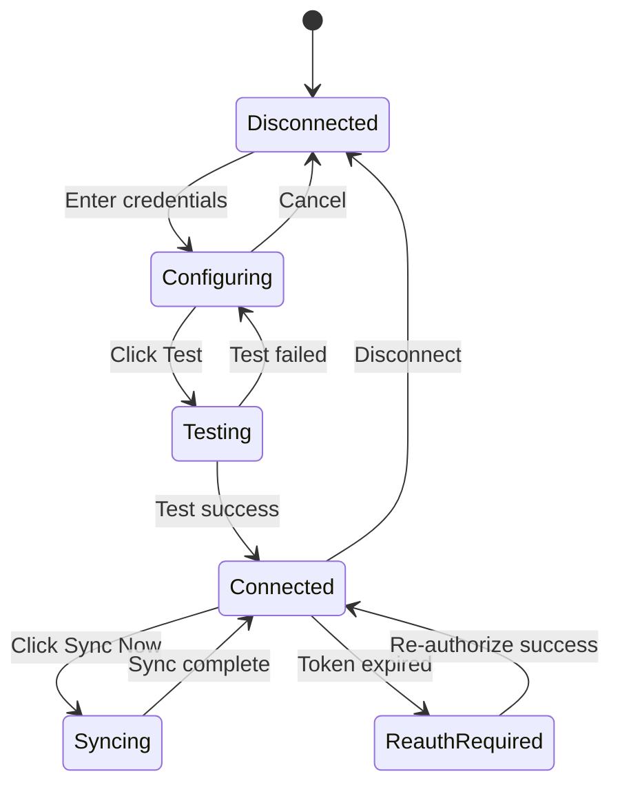
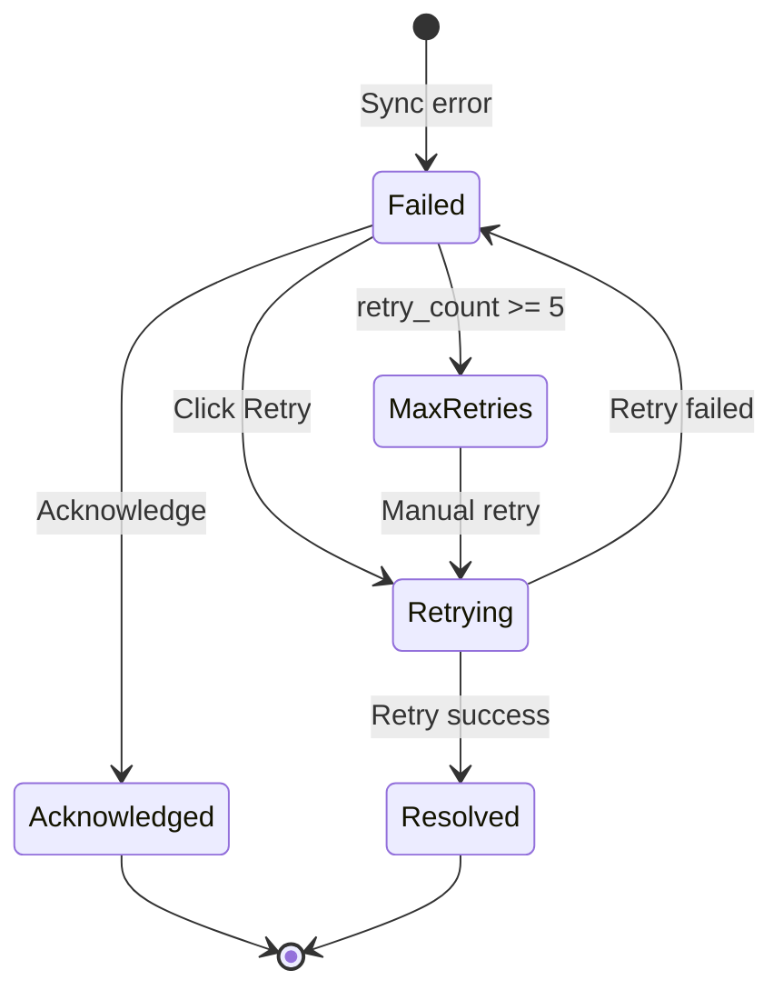

# Design Document: Sync Monitoring UI

## Overview

The Sync Monitoring UI provides a comprehensive frontend interface for managing data synchronization between EasySale POS and external platforms. This design builds upon the existing `SyncDashboardPage`, `IntegrationsPage`, and sync components while adding enhanced functionality for connector configuration, failed record management, and schedule control.

The design follows EasySale's established patterns: React with TypeScript, semantic theming tokens, capability-based feature gating, and the existing `syncApi` service layer.

## Architecture

### Information Architecture

```
┌─────────────────────────────────────────────────────────────────┐
│                        App Shell                                 │
│  ┌─────────────────────────────────────────────────────────────┐│
│  │ Header: [Logo] [Nav] [ScopeSelector] [User]                 ││
│  └─────────────────────────────────────────────────────────────┘│
│  ┌──────────┬──────────────────────────────────────────────────┐│
│  │ Sidebar  │                 Content Area                      ││
│  │          │  ┌────────────────────────────────────────────┐  ││
│  │ Settings │  │  Page Header + Actions                     │  ││
│  │ ├─ ...   │  ├────────────────────────────────────────────┤  ││
│  │ ├─ Integ │  │                                            │  ││
│  │ ├─ Sync  │  │  Page Content                              │  ││
│  │ └─ ...   │  │  (Dashboard / History / Failed / etc.)     │  ││
│  │          │  │                                            │  ││
│  │          │  └────────────────────────────────────────────┘  ││
│  └──────────┴──────────────────────────────────────────────────┘│
└─────────────────────────────────────────────────────────────────┘
```

### Route Structure

| Route | Component | Description |
|-------|-----------|-------------|
| `/admin` → `integrations` | `IntegrationsPage` | Connector cards with connect/test/sync |
| `/admin` → `sync-dashboard` | `SyncDashboardPage` | Real-time status and metrics |
| `/admin` → `sync-history` | `SyncHistoryPage` | Paginated sync history with filters |
| `/admin` → `sync-failed` | `FailedRecordsPage` | Failed records queue management |

Note: Routes are accessed via the Admin settings sidebar, not as top-level routes.

### Component Hierarchy

```
AdminPage
├── IntegrationsPage (enhanced)
│   ├── ScopeSelector
│   ├── ConnectorCard[]
│   │   ├── StatusChip
│   │   ├── CircuitBreakerBadge
│   │   ├── CredentialsForm (per connector type)
│   │   ├── SyncDirectionToggle
│   │   ├── DeletePolicyToggle
│   │   └── ActionButtons (Test, Save, Sync, Disconnect)
│   ├── MappingEditor (modal/drawer)
│   └── SyncScheduleManager (modal/drawer)
│
├── SyncDashboardPage (enhanced)
│   ├── ScopeSelector
│   ├── MetricTiles[]
│   ├── SystemHealthCard
│   ├── CircuitBreakerStatusCard
│   ├── EntitySyncControls
│   ├── ConnectionStatusCards[]
│   └── RecentSyncActivity
│
├── SyncHistoryPage (new)
│   ├── ScopeSelector
│   ├── HistoryFilters
│   ├── SyncHistoryTable
│   └── SyncDetailsModal
│
└── FailedRecordsPage (enhanced)
    ├── ScopeSelector
    ├── FailedRecordsFilters
    ├── BulkActionsBar
    ├── FailedRecordsTable
    └── PayloadDetailsModal
```

## Components and Interfaces

### ScopeSelector Component

```typescript
interface ScopeSelectorProps {
  value: 'all' | string; // 'all' or store_id (UUIDs, never 'all')
  onChange: (scope: 'all' | string) => void;
  stores: Array<{ id: string; name: string }>;
  disabled?: boolean;
}

// Persists to sessionStorage key: 'easysale_sync_scope'
// On init: validates persisted scope still exists, falls back to 'all' if not
```

### OAuth Callback Flow

```typescript
// OAuth callback is handled by backend, which redirects to frontend route
// Frontend route: /integrations/oauth/callback?platform={platform}&success={boolean}&error={message}

interface OAuthCallbackParams {
  platform: string;
  success: boolean;
  state: string; // Must match expected state
  error?: string;
}

// Flow:
// 1. User clicks "Connect" → frontend generates state, stores in sessionStorage as `oauth_state_{platform}`
// 2. Frontend calls getAuthUrl() → opens popup with state param
// 3. User authorizes in popup → redirected to backend callback
// 4. Backend validates state, exchanges code for tokens, stores credentials
// 5. Backend redirects popup to frontend callback route with state
// 6. Frontend callback route:
//    - Validates state matches sessionStorage `oauth_state_{platform}`
//    - If mismatch: shows error, does not trust result
//    - Stores result in sessionStorage: `oauth_result_{platform}`
//    - Closes popup via window.close()
// 7. Parent window detects popup close, reads result, shows toast
// 8. Parent window refreshes connector status

// Popup-blocked fallback:
// If window.open returns null, show "Popup blocked" message with:
// - "Open authorization link" button (same-tab navigation)
// - Instructions to allow popups for this site
```

### ConnectorCard Component

```typescript
interface ConnectorCardProps {
  connector: {
    id: string;
    name: string;
    description: string;
    status: ConnectorStatus;
    lastSync?: string;
    pendingCount?: number;
    failedCount?: number;
    circuitBreaker?: CircuitBreakerState;
  };
  onConnect: (credentials: unknown) => Promise<void>;
  onDisconnect: () => Promise<void>;
  onTest: () => Promise<{ success: boolean; message: string }>;
  onSyncNow: (mode: 'incremental' | 'full') => Promise<void>;
  onOpenSettings: () => void;
  onOpenMapping: () => void;
  onOpenSchedules: () => void;
  permissions: {
    canEdit: boolean;
    canSync: boolean;
    canDisconnect: boolean;
    canFullResync: boolean;
  };
}

type ConnectorStatus = 
  | 'connected' 
  | 'disconnected' 
  | 'degraded' 
  | 'reauth_required' 
  | 'error';

type CircuitBreakerState = 'closed' | 'open' | 'half_open';
```

### StatusChip Component

```typescript
interface StatusChipProps {
  status: ConnectorStatus | SyncRunStatus;
  size?: 'sm' | 'md';
}

// Maps status to semantic color tokens:
// connected/completed → success
// running → primary (animated)
// degraded/half_open → warning
// error/failed/open → error
// disconnected/queued/skipped → muted
```

### SyncHistoryTable Component

```typescript
interface SyncHistoryTableProps {
  entries: SyncHistoryEntry[];
  total: number;
  page: number;
  pageSize: number;
  onPageChange: (page: number) => void;
  onRowClick: (syncId: string) => void;
  loading?: boolean;
}

interface SyncHistoryEntry {
  id: number;
  syncId: string;
  entity: string;
  operation: string;
  status: SyncRunStatus;
  recordsProcessed: number;
  recordsFailed: number;
  startedAt: string;
  completedAt?: string;
  errorMessage?: string;
}

type SyncRunStatus = 
  | 'queued' 
  | 'running' 
  | 'completed' 
  | 'failed' 
  | 'skipped';
```

### FailedRecordsTable Component

```typescript
interface FailedRecordsTableProps {
  records: FailedRecord[];
  selectedIds: Set<number>;
  onSelectionChange: (ids: Set<number>) => void;
  onRetry: (id: number) => Promise<void>;
  onAcknowledge: (id: number) => Promise<void>;
  onViewPayload: (record: FailedRecord) => void;
  permissions: {
    canRetry: boolean;
    canAcknowledge: boolean;
    canViewPayload: boolean;
  };
}

interface FailedRecord {
  id: number;
  entity: string;
  sourceId: string;
  errorMessage: string;
  retryCount: number;
  maxRetries: number;
  nextRetryAt?: string;
  lastAttemptAt: string;
  createdAt: string;
  payload?: unknown; // Only populated when viewing details
}
```

### PayloadDetailsModal Component

```typescript
interface PayloadDetailsModalProps {
  record: FailedRecord;
  onClose: () => void;
  onRetry: () => Promise<void>;
}

// Implements PII redaction:
// - Masks email: j***@example.com
// - Masks phone: ***-***-1234
// - Redacts: password, token, api_key, card_number
```

### useSyncQuery Hook

```typescript
interface UseSyncQueryOptions<T> {
  scope: 'all' | string;
  pollingInterval?: number; // ms, default 30000
  pauseWhenHidden?: boolean; // default true
  enabled?: boolean;
}

function useSyncQuery<T>(
  key: string,
  fetcher: (scope: string) => Promise<T>,
  options: UseSyncQueryOptions<T>
): {
  data: T | undefined;
  isLoading: boolean;
  isError: boolean;
  error: Error | null;
  refetch: () => Promise<void>;
  isRefetching: boolean;
};
```

## Data Models

### Sync Configuration Models

```typescript
interface SyncDirectionConfig {
  global_direction: SyncDirection;
  entity_overrides: Record<string, SyncDirection>;
}

type SyncDirection = 'pull' | 'push' | 'bidirectional' | 'disabled';

interface DeletePolicyConfig {
  global_policy: DeletePolicy;
  entity_overrides: Record<string, DeletePolicy>;
}

type DeletePolicy = 'local_only' | 'archive_remote' | 'delete_remote';
```

### Mapping Models

```typescript
interface FieldMapping {
  id: string;
  sourceField: string;
  targetField: string;
  transformation?: MappingTransformation;
}

type MappingTransformation = 
  | { type: 'none' }
  | { type: 'uppercase' }
  | { type: 'lowercase' }
  | { type: 'trim' }
  | { type: 'format'; pattern: string }
  | { type: 'lookup'; table: string };
```

### Schedule Models

```typescript
interface SyncSchedule {
  id: number;
  entity: string;
  cronExpression: string;
  timezone: string;
  mode: 'full' | 'incremental';
  enabled: boolean;
  concurrencyPolicy: 'queue' | 'skip';
  lastRun?: string;
  nextRun?: string;
  status?: 'idle' | 'running';
}
```

### Audit Log Model

```typescript
interface AuditLogEntry {
  id: string;
  action: string;
  entityType: string;
  entityId?: string;
  userId: string;
  userName: string;
  timestamp: string;
  changes?: {
    before: unknown;
    after: unknown;
  };
}
```


## Correctness Properties

*A property is a characteristic or behavior that should hold true across all valid executions of a system—essentially, a formal statement about what the system should do. Properties serve as the bridge between human-readable specifications and machine-verifiable correctness guarantees.*


### Property 1: Connector Rendering Based on Status and Capability

*For any* connector with a given status (connected/disconnected/degraded/reauth_required/error) and capability flags, the UI SHALL render the appropriate controls: disconnected shows credentials form, connected shows Sync Now button, reauth_required shows Re-authorize button, and sync-capable connectors show direction/policy controls.

**Validates: Requirements 1.2, 1.5, 1.9, 11.4**

### Property 2: Sync Status Visual Indicators

*For any* sync run status (queued/running/completed/failed/skipped), the StatusChip component SHALL display the correct icon and semantic color token: running shows spinning indicator with primary color, completed shows checkmark with success color, failed shows X with error color.

**Validates: Requirements 2.3, 2.4**

### Property 3: History Filtering Correctness

*For any* combination of filters (entity type, status, date range), the sync history table SHALL display only entries that match ALL applied filters. The result set size SHALL be less than or equal to the unfiltered set size.

**Validates: Requirements 3.4, 3.5, 3.6**

### Property 4: RBAC-Based Control Rendering

*For any* user permission set, action buttons SHALL be rendered as enabled only when the user has the required permission. Destructive actions (disconnect, delete, policy changes) SHALL require elevated permissions and display confirmation dialogs. View-only users SHALL see all data but have all modification controls disabled with explanatory tooltips.

**Validates: Requirements 9.1, 9.2, 9.3, 9.4, 9.5**

### Property 5: Scope-Based Data Filtering

*For any* scope selection (all stores or specific store), all displayed data (connectors, history, failed records, metrics) SHALL be filtered to that scope. The scope selector SHALL be visible when the user has access to multiple stores. Settings SHALL display scope level indicators (tenant/store/global).

**Validates: Requirements 10.1, 10.2, 10.3, 10.4**

### Property 6: Bulk Selection State Management

*For any* selection state in the failed records table, the "Retry Selected" and "Acknowledge Selected" actions SHALL be enabled if and only if at least one record is selected. The selection count SHALL be displayed accurately.

**Validates: Requirements 12.1, 12.2**

### Property 7: Data Fetch State Indicators

*For any* data fetch operation, the UI SHALL display a primary state of exactly one of: loading spinner (initial fetch), content (on success with data), empty state (on success with no data), or error state with retry button (on failure). When refetching while content is displayed, a secondary "Refreshing..." indicator MAY be shown alongside the content.

**Validates: Requirements 14.1, 14.2, 14.3**

### Property 8: PII Redaction in Payloads

*For any* payload containing sensitive fields (password, token, api_key, card_number, email, phone, address), the PayloadDetailsModal SHALL redact or mask those fields. Passwords/tokens/keys SHALL be fully redacted. Email/phone SHALL show partial values. A "Sensitive data redacted" notice SHALL be displayed. Redaction applies to ALL roles including admins.

**Validates: Requirements 12.4, 11.6**

### Property 9: Failed Record Field Display

*For any* failed record, the table row SHALL display: entity type, source ID, error message (truncated if needed), retry count, and last attempt timestamp. All required fields SHALL be present and non-empty.

**Validates: Requirements 4.2, 12.5**

### Property 10: Max Retry Indicator

*For any* failed record where retry count >= 5 (max retries), the UI SHALL display a "Max Retries Exceeded" badge. Records below max retries SHALL NOT display this badge.

**Validates: Requirements 4.7, 12.6**

### Property 11: Session Storage Scope Persistence

*For any* scope selection, the value SHALL be persisted to sessionStorage under key `easysale_sync_scope`. On page reload, the scope selector SHALL initialize to the persisted value if it still exists (store is accessible). If no persisted value exists or the persisted store is no longer accessible, it SHALL default to 'all'.

**Validates: Requirements 10.5**

### Property 12: Credential Masking

*For any* saved credentials, sensitive fields (passwords, secrets, tokens) SHALL never be re-displayed in full. The UI SHALL show masked placeholders (e.g., "••••••••") for saved credential fields.

**Validates: Requirements 11.1**

### Property 13: Error Message Display Without Sensitive Data

*For any* connection test failure, the displayed error message SHALL NOT contain: API keys, passwords, tokens, or full URLs with credentials. Error messages SHALL be informative but sanitized.

**Validates: Requirements 1.8, 11.6**

## Error Handling

### Offline Behavior

Since EasySale is offline-first, the sync UI must handle offline states gracefully:

```typescript
// Caching Strategy: "Last Known Snapshot"
// - Sync monitoring data is cached in sessionStorage with timestamp
// - When online: fetch fresh data (polling every 30s)
// - When offline: show cached data with "As of {timestamp}" indicator
// - Write actions (Sync Now, Retry, etc.) are disabled when offline

// When is_online === false from /api/sync/status:
// 1. "Sync Now" buttons are disabled with tooltip: "Sync unavailable while offline"
// 2. Dashboard shows offline banner: "You are currently offline. Data shown as of {timestamp}."
// 3. Failed record retries are queued to IndexedDB and executed when online
// 4. All read operations show cached data with staleness indicator

// Offline Retry Queue (IndexedDB: 'easysale_sync_retry_queue')
// - Stores: { id, action, payload, timestamp }
// - Flushes when: online event + tab visible + user authenticated
// - Deduping: skip if same id already in queue
// - On flush: if server returns "already resolved", remove from queue silently
```

### API Error Handling Strategy

```typescript
interface ApiError {
  error: string;
  code?: string;
  details?: unknown;
}

// Error handling in useSyncQuery hook
const handleApiError = (error: unknown): void => {
  if (axios.isAxiosError(error)) {
    const apiError = error.response?.data as ApiError;
    
    switch (error.response?.status) {
      case 401:
        // Redirect to login
        toast.error('Session expired. Please log in again.');
        navigate('/login');
        break;
      case 403:
        // Permission denied
        toast.error('You do not have permission to perform this action.');
        break;
      case 404:
        // Resource not found
        toast.error(apiError?.error || 'Resource not found.');
        break;
      case 422:
        // Validation error
        toast.error(apiError?.error || 'Invalid data provided.');
        break;
      case 500:
      default:
        // Server error
        toast.error('An error occurred. Please try again.');
        console.error('API Error:', apiError);
    }
  } else {
    // Network error
    toast.error('Network error. Please check your connection.');
  }
};
```

### Retry Logic for Failed Operations

```typescript
const retryWithBackoff = async <T>(
  operation: () => Promise<T>,
  maxRetries: number = 3,
  baseDelay: number = 1000
): Promise<T> => {
  let lastError: Error;
  
  for (let attempt = 0; attempt < maxRetries; attempt++) {
    try {
      return await operation();
    } catch (error) {
      lastError = error as Error;
      if (attempt < maxRetries - 1) {
        const delay = baseDelay * Math.pow(2, attempt);
        await new Promise(resolve => setTimeout(resolve, delay));
      }
    }
  }
  
  throw lastError!;
};
```

### OAuth Error States

| Error | User Message | Action |
|-------|--------------|--------|
| Consent denied | "Authorization was denied. Please try again and approve access." | Show retry button |
| Token expired | "Your session has expired. Please re-authorize." | Show re-authorize button |
| Token revoked | "Access was revoked. Please reconnect the integration." | Show connect button |
| Invalid state | "Authorization failed. Please try again." | Show retry button |

## Testing Strategy

### Unit Testing

Unit tests focus on specific component behavior and edge cases:

- **StatusChip**: Verify correct icon and color for each status value
- **ScopeSelector**: Verify sessionStorage persistence and initialization
- **PayloadDetailsModal**: Verify PII redaction for various field patterns
- **ConfirmDialog**: Verify keyboard navigation and focus management

### Property-Based Testing

Property tests verify universal properties across generated inputs using `fast-check`:

```typescript
// Example: Property 3 - History Filtering
import * as fc from 'fast-check';

describe('SyncHistory filtering', () => {
  it('filtered results are subset of unfiltered', () => {
    fc.assert(
      fc.property(
        fc.array(syncHistoryEntryArbitrary),
        fc.option(entityTypeArbitrary),
        fc.option(statusArbitrary),
        (entries, entityFilter, statusFilter) => {
          const filtered = filterHistory(entries, { entity: entityFilter, status: statusFilter });
          return filtered.length <= entries.length &&
                 filtered.every(e => entries.includes(e));
        }
      ),
      { numRuns: 100 }
    );
  });
});
```

### Test Configuration

- **Framework**: Vitest with React Testing Library
- **Property Testing**: fast-check
- **Minimum iterations**: 100 per property test
- **Coverage target**: 80% for business logic components

### Accessibility Testing

- **axe-core**: Automated accessibility checks in component tests
- **Keyboard navigation**: Manual testing for all interactive flows
- **Screen reader**: VoiceOver/NVDA testing for modal dialogs

## Mermaid Diagrams

### Sync Dashboard Data Flow

```mermaid
flowchart TD
    A[SyncDashboardPage] --> B[useSyncQuery hooks]
    B --> C{Tab Visible?}
    C -->|Yes| D[Poll every 30s]
    C -->|No| E[Pause polling]
    D --> F[syncApi calls]
    F --> G[/api/sync/status]
    F --> H[/api/sync/metrics]
    F --> I[/api/integrations/health]
    F --> J[/api/sync/circuit-breaker/status]
    G --> K[Update State]
    H --> K
    I --> K
    J --> K
    K --> L[Render Components]
    L --> M[MetricTiles]
    L --> N[SystemHealthCard]
    L --> O[CircuitBreakerStatusCard]
    L --> P[ConnectionStatusCards]
```

### Connector Configuration Flow



### Failed Record Lifecycle


