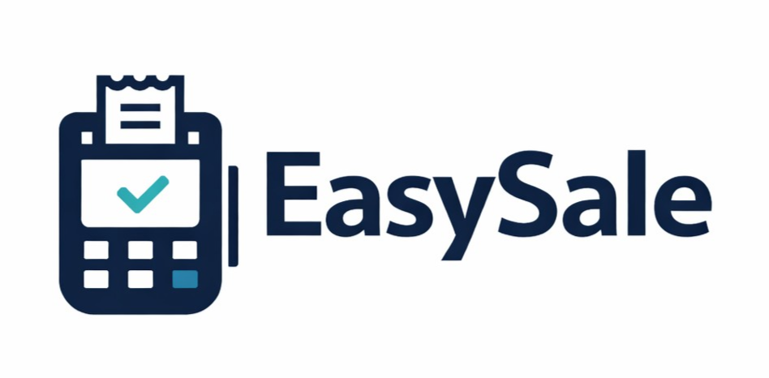

<p align="center">
  
</p>

<h1 align="center">EasySale</h1>

<p align="center">
  <strong>White-Label, Multi-Tenant Point of Sale System</strong>
</p>

<p align="center">
  A flexible, configuration-driven POS system that adapts to any retail business.<br>
  Built offline-first to ensure continuous operation regardless of connectivity.
</p>

<p align="center">
  <a href="https://github.com/derickladwig/EasySale/actions/workflows/ci.yml"></a>
  <a href="https://github.com/derickladwig/EasySale/actions/workflows/cd.yml"></a>
  <a href="LICENSE"></a>
</p>

<p align="center">
  <a href="https://www.loom.com/share/94fcc053be2643d580f0ca8a9936425a"><strong>📺 Watch Demo Video</strong></a>
</p>

<p align="center">
  
  
  
  
  
</p>

---

## Overview

EasySale is a production-ready, white-label point-of-sale system designed for retail businesses of any size. It uses **JSON configuration files** to adapt to your business—no code changes required.

### Key Capabilities

| Feature | Description |
|---------|-------------|
| **Offline-First** | 100% functionality without internet; syncs when connected |
| **White-Label** | Full branding customization via configuration |
| **Multi-Store Sync** | Automatic replication between locations |
| **Role-Based Access** | 7 granular permission levels |
| **Build Variants** | Choose features you need (Lite, Export, Full) |
| **Multi-Tenant** | Isolated data per business |

---

## Quick Start

### Prerequisites

| Software | Version | Required |
|----------|---------|----------|
| Node.js | ≥20.0.0 | Yes |
| Rust | ≥1.75 | Yes |
| Docker | ≥20.10 | Optional |

### System Requirements

| Resource | Minimum | Recommended |
|----------|---------|-------------|
| RAM | 4 GB | 8 GB |
| Disk | 10 GB | 20 GB |
| CPU | 2 cores | 4+ cores |

### Build Times

Approximate times on modern hardware (8-core CPU, 16GB RAM):

| Build Type | First Build | Cached/Incremental |
|------------|-------------|-------------------|
| Docker Production | 10-20 minutes | 2-5 minutes |
| Local Rust | 3-6 minutes | 10-30 seconds |
| Frontend | 30-60 seconds | 5-10 seconds |

**Fresh Install Total**: ~20-30 minutes (first time with Docker)

### Installation

```bash
# Clone the repository
git clone https://github.com/derickladwig/EasySale.git
cd EasySale

# Copy environment template
cp .env.example .env

# Start with Docker (recommended)
./docker-start.sh        # Linux/Mac
start-dev.bat            # Windows
```

### Access

| Service | URL |
|---------|-----|
| Frontend | http://localhost:7945 |
| Backend API | http://localhost:8923 |
| Health Check | http://localhost:8923/health |

**Default Login Credentials**:
- **Username**: `admin`
- **Password**: `admin123`

> **Important**: Change the default password immediately after first login via **Settings → My Preferences → Security**. The Setup Wizard will guide you through initial store configuration.

---

## Build Variants

EasySale offers three build variants to match your needs:

| Variant | Features | Use Case | Developer Setup |
|---------|----------|----------|-----------------|
| **Lite** | Core POS, Products, Inventory, Customers | Basic retail operations | None required |
| **Export** | Lite + Admin Panel, Reporting, CSV Export | Most businesses (recommended) | None required |
| **Full** | Export + OCR, Document Processing, Vendor Bills | Enterprise document workflows | Customization likely needed |

### Choosing Your Build

- **Lite** — Basic POS functionality. Works out of the box for simple retail.

- **Export** (Default) — Recommended for most users. Includes admin panel, reporting, and CSV export. No developer customization needed.

- **Full** — Advanced features including OCR document processing and vendor bill workflows. **Note**: Document processing features may require developer customization depending on your specific document formats, vendor invoice layouts, and approval workflows. The OCR templates and field mappings will likely need adjustment to match your suppliers' invoice formats.

### Build Commands

```bash
# Backend
cargo build --release -p easysale-server --no-default-features              # Lite
cargo build --release -p easysale-server --no-default-features --features export   # Export (default)
cargo build --release -p easysale-server --no-default-features --features full     # Full

# Frontend
cd frontend
npm run build:lite    # Lite UI
npm run build:export  # Export UI (default)
npm run build:full    # Full UI
```

### Windows Build Scripts

```powershell
build-prod.bat --lite    # Lite variant
build-prod.bat --export  # Export variant (default, recommended)
build-prod.bat --full    # Full variant (may require customization)
```

### Full Build Customization Notes

If using the Full build with document processing features:

1. **OCR Templates** — Vendor invoice layouts vary widely. You may need to configure or create OCR templates for your specific suppliers.
2. **Field Mappings** — Map extracted fields to your inventory/accounting fields.
3. **Approval Workflows** — Customize the review queue logic for your business rules.
4. **Document Types** — Add support for additional document formats as needed.

See [docs/deployment/ocr_deployment.md](docs/deployment/ocr_deployment.md) for detailed customization guidance.

---

## Architecture

```
┌─────────────────────────────────────────────────────────────┐
│                     Frontend (React 19)                      │
│              TypeScript • Vite • Tailwind CSS                │
│                       Port: 7945                             │
└─────────────────────────┬───────────────────────────────────┘
                          │ REST API
                          ▼
┌─────────────────────────────────────────────────────────────┐
│                    Backend (Rust)                            │
│                Actix-web • 150+ endpoints                    │
│                       Port: 8923                             │
└─────────────────────────┬───────────────────────────────────┘
                          │
                          ▼
┌─────────────────────────────────────────────────────────────┐
│                   Database (SQLite)                          │
│              Embedded • WAL mode • Offline-first             │
└─────────────────────────────────────────────────────────────┘
```

### Backend Workspace

```
backend/crates/
├── server/                 # Main API server (Actix-web)
├── pos_core_domain/        # Pure business logic (pricing, tax, discounts)
├── pos_core_models/        # Shared types and traits
├── pos_core_storage/       # Database access layer
├── accounting_snapshots/   # Immutable financial records
├── export_batches/         # Batch management for exports
├── capabilities/           # Feature detection API
└── csv_export_pack/        # CSV export (feature-gated)
```

---

## Feature Matrix

| Feature | Lite | Export | Full |
|---------|:----:|:------:|:----:|
| Core POS & Checkout | ✅ | ✅ | ✅ |
| Product Management | ✅ | ✅ | ✅ |
| Inventory Tracking | ✅ | ✅ | ✅ |
| Customer Management | ✅ | ✅ | ✅ |
| Multi-Store Sync | ✅ | ✅ | ✅ |
| Admin Panel | — | ✅ | ✅ |
| Reporting Dashboard | — | ✅ | ✅ |
| CSV Export | — | ✅ | ✅ |
| OCR Document Processing | — | — | ✅ |
| Vendor Bill Workflow | — | — | ✅ |
| Review Queue | — | — | ✅ |

### Latest Features (v1.2.3)

| Feature | Description |
|---------|-------------|
| **Demo Data Import** | One-click demo data loading for Products, Customers, Vendors |
| **Enhanced Import Wizard** | Collapsible field docs, custom attribute support, better UX |
| **Category Browser** | Hierarchical category management with search and product counts |
| **Quote Actions** | Email quotes directly to customers |
| **Inventory Management** | Delete items, bulk actions, filter modal |
| **Receipt Branding** | Dynamic company info, logo, and tax display on receipts |
| **Per-Item Cart Adjustments** | Override prices and apply discounts per line item |
| **Stock Validation** | Real-time stock check prevents overselling |

---

## Optional Integrations

EasySale supports external integrations that require your own credentials:

### QuickBooks Online

To enable QuickBooks integration:

1. Create a QuickBooks Developer account
2. Register your application to get Client ID and Secret
3. Configure environment variables:
   ```bash
   QUICKBOOKS_CLIENT_ID=your_client_id
   QUICKBOOKS_CLIENT_SECRET=your_client_secret
   QUICKBOOKS_REDIRECT_URI=https://your-domain.com/api/integrations/quickbooks/callback
   ```

### WooCommerce

To enable WooCommerce sync:

1. Generate API keys in your WooCommerce store (Settings → REST API)
2. Configure in Admin → Integrations → WooCommerce

### Payment Terminals (Stripe/Square)

Payment terminal integration requires additional configuration:

1. Obtain API credentials from your payment provider
2. Configure terminal settings in Admin → Payment Settings
3. See [Payment Integration Guide](docs/integrations/stripe-connect-setup.md) for details

> **Note**: These integrations are optional and not required for core POS functionality.

---

## Configuration

EasySale uses JSON configuration for customization:

```
configs/
├── default.json       # Default configuration
├── schema.json        # JSON Schema for validation
├── private/           # Tenant-specific configs (gitignored)
└── examples/          # Example configurations
```

Set your tenant via environment:
```bash
export TENANT_ID=my-store
```

See [configs/README.md](configs/README.md) for detailed configuration options.

---

## Development

### Local Development

```bash
# Terminal 1: Backend
cd backend
cargo run --bin easysale-server

# Terminal 2: Frontend
cd frontend
npm install
npm run dev
```

### Running Tests

```bash
# Backend tests
cd backend && cargo test

# Frontend tests
cd frontend && npm run test:run

# Linting
cargo clippy            # Backend
npm run lint            # Frontend
```

### Capabilities API

The backend exposes `/api/capabilities` to report available features:

```bash
curl http://localhost:8923/api/capabilities
```

The frontend queries this on startup and adapts the UI to show only available features.

---

## Documentation

| Category | Links |
|----------|-------|
| **Getting Started** | [Quick Start](#quick-start) • [Installation Guide](docs/INSTALL.md) |
| **Architecture** | [Design Spec](spec/design.md) • [Tech Stack](.kiro/steering/tech.md) |
| **API Reference** | [Backend Routes](audit/ROUTES_BACKEND.md) • [Capabilities API](#capabilities-api) |
| **Configuration** | [Config Guide](configs/README.md) • [Schema](configs/schema.json) |
| **Operations** | [Runbook](docs/RUNBOOK.md) • [Checklists](spec/CHECKLISTS.md) |
| **Deployment** | [Build Guide](docs/deployment/BUILD_GUIDE.md) • [Docker Guide](docs/deployment/) |

---

## Project Structure

```
EasySale/
├── backend/           # Rust API server (Actix-web)
│   ├── crates/        # Cargo workspace (8 crates)
│   └── migrations/    # SQLite migrations
├── frontend/          # React + TypeScript + Vite
│   └── src/
│       ├── features/  # Feature modules
│       ├── common/    # Shared components
│       └── domains/   # Business logic
├── configs/           # Tenant configuration files
├── docs/              # Documentation
├── spec/              # Specifications (req, design, plan)
├── ci/                # CI scripts and property tests
└── audit/             # Quality assurance reports
```

---

## Development Story — Kiro AI Hackathon 2026

EasySale was built for the **Kiro AI Hackathon 2026** using a spec-driven, AI-assisted workflow. This section documents the development process and tools used.

### AI-Assisted Development Workflow

| Tool | Role | Usage |
|------|------|-------|
| **Kiro (Claude Sonnet 4)** | Primary development | Spec phases, structured task execution, code generation |
| **ChatGPT** | Planning & refinement | Scope consolidation, idea refinement, documentation review |
| **Cursor** | Late-stage polish | Code review, cleanup, repository management |

### The Spec-Driven Process

The entire project was built using Kiro's spec-driven approach:

1. **Requirements** → Define what to build in `spec/req.md`
2. **Design** → Architecture decisions in `spec/design.md`
3. **Tasks** → Break down into executable tasks in `.kiro/specs/*/tasks.md`
4. **Execute** → Let Kiro implement each task systematically
5. **Iterate** → Refine based on results

This process is documented in detail in:
- [`.kiro/DEVELOPMENT_LOG.md`](.kiro/DEVELOPMENT_LOG.md) — Comprehensive development timeline
- [`docs/consolidated/05_KIRO_PROCESS.md`](docs/consolidated/05_KIRO_PROCESS.md) — Kiro workflow documentation
- [`blog/`](blog/) — 72+ development blog posts

### Memory Bank System

The project uses a **Memory Bank** workflow (inspired by [Jordan Hindo](https://github.com/jordanhindo)) for AI context persistence:

```
memory-bank/
├── MEMORY_SYSTEM.md      # Operating instructions for AI
├── project_brief.md      # Static project context
├── active-state.md       # Current session state
├── system_patterns.md    # Patterns and gotchas
└── adr/                  # Architecture Decision Records
```

Core principle: *"Files, not chat. Documents, not memory. Receipts, not vibes."*

### Demo & Documentation Tools

| Tool | Purpose |
|------|---------|
| **OpenAI Sora** | Video generation for demos |
| **Loom** | Screen recording and walkthroughs |
| **Guidde** | Interactive documentation |

### Development Timeline Highlights

| Phase | Dates | Focus |
|-------|-------|-------|
| Foundation | Jan 9-10 | React + Rust + SQLite setup |
| Design System | Jan 10-11 | White-label theming |
| Multi-Tenant | Jan 11-12 | Tenant isolation |
| Documentation | Jan 13-14 | Spec alignment |
| Data Sync | Jan 15-17 | Universal sync engine |
| Backend Complete | Jan 18 | 150+ API endpoints |
| Production Polish | Jan 27-29 | Build variants, cleanup |
| Hackathon Prep | Jan 30 | Documentation, demo |

### Documentation Structure

```
EasySale/
├── .kiro/                  # Kiro AI configuration
│   ├── steering/           # Product/tech/structure docs
│   ├── specs/              # 26 feature specifications
│   ├── prompts/            # Reusable AI prompts
│   └── DEVELOPMENT_LOG.md  # Main development log
├── blog/                   # 72+ development blog posts
├── docs/consolidated/      # 8 canonical documentation files
├── memory-bank/            # AI memory system with ADRs
├── archive/                # 300+ historical status reports
└── audit/                  # Truth-sync and quality audits
```

### Key Metrics

- **23 days** of development
- **26 feature specs** in `.kiro/specs/`
- **72+ blog posts** documenting progress
- **300+ status reports** in archive
- **150+ API endpoints** implemented
- **50+ database tables**
- **0 TypeScript errors**, **0 Rust warnings**

For the complete development story, see [`.kiro/DEVELOPMENT_LOG.md`](.kiro/DEVELOPMENT_LOG.md).

---

## Contributing

1. Fork the repository
2. Create a feature branch: `git checkout -b feature/my-feature`
3. Run tests: `cargo test && npm run test:run`
4. Run linters: `cargo clippy && npm run lint`
5. Commit: `git commit -m "feat: add my feature"`
6. Push and create PR

### Commit Convention

```
type(scope): description

feat(products): add bulk import
fix(auth): resolve token expiration
docs(readme): update installation
```

---

## License

[Apache License 2.0](LICENSE) — Copyright (c) 2026 EasySale Contributors

---

## Support

| Channel | Link |
|---------|------|
| Documentation | [docs/](docs/) |
| Bug Reports | [GitHub Issues](https://github.com/derickladwig/EasySale/issues) |
| Discussions | [GitHub Discussions](https://github.com/derickladwig/EasySale/discussions) |
| Security | [SECURITY.md](SECURITY.md) |

---

<p align="center">
  <strong>Built with Rust, React, and TypeScript</strong>
</p>
