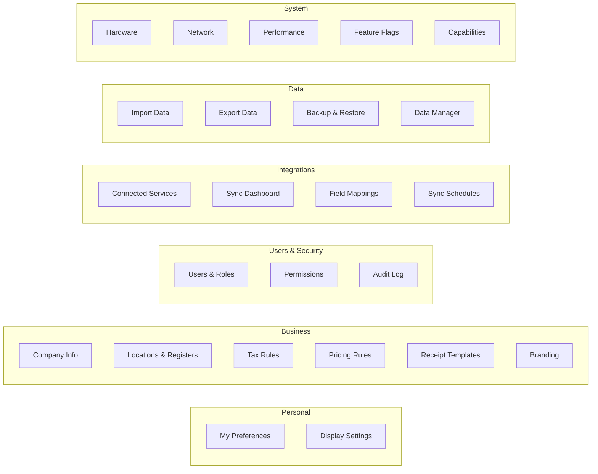

# Settings Architecture Audit and Reorganization Plan

**Date:** January 30, 2026  
**Status:** Audit Complete - Implementation Pending  
**Priority:** Medium-High (UX Impact)

## Current State Analysis

### Architecture Overview

```mermaid
flowchart TD
    subgraph sidebar [Main Sidebar]
        Admin[Admin Entry Point]
    end
    
    subgraph adminPage [AdminPage.tsx - Tab-Based]
        AP_Tabs[21 Internal Tabs]
        AP_General[General]
        AP_Display[Display]
        AP_Users[Users]
        AP_Store[Store Info]
        AP_Payment[Payment - Placeholder]
        AP_Hardware[Hardware]
        AP_Backup[Backup]
        AP_Security[Security - Placeholder]
        AP_Notifications[Notifications - Placeholder]
        AP_Preferences[My Preferences]
        AP_Company[Company & Stores]
        AP_Network[Network & Sync]
        AP_Localization[Localization]
        AP_ProductConfig[Product Config]
        AP_DataMgmt[Data Management]
        AP_DataMgr[Data Manager]
        AP_TaxRules[Tax Rules]
        AP_Integrations[Integrations]
        AP_SyncDash[Sync Dashboard]
        AP_FeatureFlags[Feature Flags]
        AP_Performance[Performance]
    end
    
    subgraph adminLayout [AdminLayout.tsx - Route-Based]
        AL_Routes[17 Sub-Routes]
    end
    
    subgraph settingsPages [Settings Pages Folder]
        SP[13 Reused Pages]
    end
    
    Admin --> adminPage
    Admin --> adminLayout
    AP_Tabs --> settingsPages
    AL_Routes --> settingsPages
```



## Critical Issues Found

### Issue 1: Overwhelming Flat Navigation (21 Items)

**Location:** `frontend/src/admin/pages/AdminPage.tsx` lines 103-234

The `settingsSections` array contains 21 items displayed as a flat list:

```typescript
const settingsSections: SettingsSection[] = [
  { id: 'preferences', label: 'My Preferences', ... },
  { id: 'company', label: 'Company & Stores', ... },
  { id: 'network', label: 'Network & Sync', ... },
  // ... 18 more items
];
```

**Problem:** Users must scroll through 21 items to find what they need. No grouping, no search, no filtering.

---

### Issue 2: Dual Navigation Architecture (Tabs vs Routes)

Two competing navigation patterns exist:

| Pattern | Location | How It Works |
|---------|----------|--------------|
| Tab-based | `AdminPage.tsx` | State-driven (`activeSection` state) |
| Route-based | `AdminLayout.tsx` | React Router (`<Outlet />`) |

**Problem:** Confusing UX - some settings use URL routes (`/admin/users`), others are internal tabs that don't update the URL.

---

### Issue 3: Massive Code Duplication

`AdminPage.tsx` imports and renders 13 pages from `settings/pages/`:

```typescript
// Lines 44-56 in AdminPage.tsx
import { MyPreferencesPage } from '../../settings/pages/MyPreferencesPage';
import { CompanyStoresPage } from '../../settings/pages/CompanyStoresPage';
import { NetworkPage } from '../../settings/pages/NetworkPage';
// ... 10 more imports
```

These same pages are ALSO routed via `AdminLayout.tsx` at `/admin/*` paths.

**Result:** Same page accessible two ways with different URL behavior.

---

### Issue 4: Placeholder Sections (Dead Ends)

Three sections show "coming soon" placeholders:

```typescript
// Lines 692-704 in AdminPage.tsx
{activeSection === 'payment' && <CreditCard ... />}
{activeSection === 'security' && <Shield ... />}
{activeSection === 'notifications' && <Bell ... />}
```

**Problem:** Users click these and see nothing useful.

---

### Issue 5: Route Mismatch Bug

**Location:** `frontend/src/config/navigation.ts` line 249

```typescript
{
  id: 'admin-branding',
  path: '/admin/branding',
  label: 'Branding',
  // But App.tsx routes /admin/branding to LocalizationPage, not BrandingSettingsPage
}
```

---

### Issue 6: Overlapping/Redundant Sections

| Section A | Section B | Overlap |
|-----------|-----------|---------|
| Store Info | Company & Stores | Both manage store details |
| Backup & Sync | Network & Sync | Both mention "sync" |
| Data Management | Data Manager | Confusing naming |
| General | Localization | Both have language/currency |

---

### Issue 7: No Logical Grouping

Current flat list mixes:
- Personal settings (My Preferences)
- Store operations (Store Info, Tax Rules, Pricing)
- Technical settings (Network, Performance, Hardware)
- Data operations (Data Management, Exports, Imports)
- External services (Integrations, Sync Dashboard)

---

## Recommended Reorganization

### Proposed Category Structure



### Proposed Navigation Hierarchy (6 Categories, 22 Items)

| Category | Items | Current Location |
|----------|-------|------------------|
| **Personal** (2) | My Preferences, Display | AdminPage tabs |
| **Business** (6) | Company, Locations, Taxes, Pricing, Receipts, Branding | Mixed |
| **Users & Security** (3) | Users, Roles, Audit Log | UsersRolesPage |
| **Integrations** (4) | Services, Sync, Mappings, Schedules | IntegrationsPage, SyncDashboardPage |
| **Data** (4) | Import, Export, Backup, Data Manager | DataManagementPage, DataManagerPage |
| **System** (5) | Hardware, Network, Performance, Flags, Capabilities | Various pages |

---

## Recommended Implementation Changes

### Change 1: Consolidate to Route-Based Navigation Only

- Remove tab-based navigation from `AdminPage.tsx`
- Use `AdminLayout.tsx` with React Router for all admin sections
- Every settings page gets a URL (bookmarkable, shareable)

### Change 2: Add Category Grouping to Navigation

Update `frontend/src/config/navigation.ts` to add category field:

```typescript
export interface NavigationItem {
  // ... existing fields
  category?: 'personal' | 'business' | 'users' | 'integrations' | 'data' | 'system';
}
```

### Change 3: Implement Collapsible Category Sections

In `AdminLayout.tsx`, render navigation grouped by category with expand/collapse.

### Change 4: Add Settings Search

Leverage existing `settingsIndex.ts` and `SettingsSearch.tsx` which already exist but aren't prominently used.

### Change 5: Remove Placeholder Sections

Delete Payment, Security, Notifications placeholders until implemented.

### Change 6: Fix Route Mismatch

Update `App.tsx` to route `/admin/branding` to `BrandingSettingsPage` instead of `LocalizationPage`.

### Change 7: Merge Redundant Sections

| Merge From | Merge Into | New Name |
|------------|------------|----------|
| Store Info | Company & Stores | Company & Locations |
| Backup & Sync | Network & Sync | Network (move backup to Data) |
| Data Management + Data Manager | Data | Data Management |

---

## Files Requiring Changes

| File | Change Type | Priority |
|------|-------------|----------|
| `frontend/src/admin/pages/AdminPage.tsx` | Major refactor - remove tab navigation | High |
| `frontend/src/config/navigation.ts` | Add category field to items | High |
| `frontend/src/admin/components/AdminLayout.tsx` | Add category grouping UI | High |
| `frontend/src/App.tsx` | Fix `/admin/branding` route | Medium |
| `frontend/src/settings/pages/` | Consolidate redundant pages | Medium |
| `frontend/src/admin/utils/settingsIndex.ts` | Update search index for new structure | Low |

---

## Summary of Issues

| Issue | Severity | Impact |
|-------|----------|--------|
| 21 flat navigation items | High | Overwhelming UX |
| Dual navigation patterns | High | Confusing, inconsistent |
| Code duplication | Medium | Maintenance burden |
| Placeholder sections | Low | Dead ends |
| Route mismatch bug | Medium | Wrong page loads |
| Redundant sections | Medium | User confusion |
| No logical grouping | High | Hard to find settings |

---

## Recommendation

The settings architecture needs a significant refactor to:

1. **Eliminate dual navigation** - Pick route-based only
2. **Add category grouping** - 6 logical categories
3. **Add search prominence** - Leverage existing search component
4. **Remove dead ends** - Delete placeholders
5. **Fix bugs** - Route mismatch, naming inconsistencies
6. **Consolidate pages** - Merge redundant sections

This is a medium-sized refactor affecting ~10 files with high UX impact.
